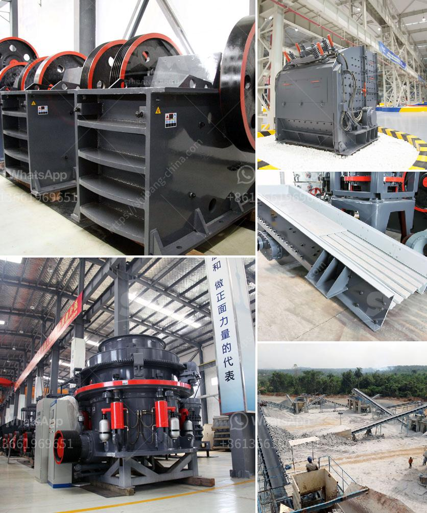

<h3>cost of copper ore processing plant</h3>
Copper is an essential metal in various industries, from electronics to construction. Therefore, the demand for copper remains high, making it a valuable resource. To meet this demand, copper ore is extracted from mines and processed into refined copper. However, setting up a copper ore processing plant is not a task for the faint-hearted. It requires substantial capital investment, expertise, and careful planning.

The cost of a copper ore processing plant plays a crucial role in the success of the project. As an entrepreneur, understanding the cost factors of copper ore processing plants will help you make informed decisions. There are several key factors that influence the cost of setting up a copper ore processing plant.

One of the primary cost considerations is the equipment used in the plant. Copper ore processing plants require crushers, conveyors, ore feeders, flotation cells, thickening and filtration equipment, amongst others. These equipment have a substantial upfront cost, which can vary depending on the scale of the plant.

Another significant cost factor is the size of the processing plant. A larger plant will require more equipment, space, and resources, ultimately driving up the cost. Therefore, it is crucial to carefully evaluate the scale of the plant based on market demand, availability of resources, and financial feasibility.

Additionally, labor costs play a vital role in the overall expenditure. Skilled workers are indispensable in operating and maintaining a copper ore processing plant. The level of expertise required may vary depending on the complexity of the plant, affecting the overall labor expenses.

Energy costs are another aspect to consider. Copper ore processing plants require a significant amount of energy for crushing, grinding, and other processing activities. The cost of energy will depend on the source and the region, as electricity prices can vary greatly.

Finally, environmental regulations and compliance also contribute to the cost. Copper ore processing plants must adhere to strict environmental standards to minimize pollution and comply with local regulations. Implementing advanced technologies and treatment systems to meet these requirements can increase the overall cost.

In conclusion, setting up a copper ore processing plant comes with substantial costs. Factors such as equipment, plant size, labor, energy, and compliance with environmental regulations all contribute to the overall expenditure. Understanding these cost factors is essential for entrepreneurs planning to venture into the copper mining industry. With careful planning and prudent decision-making, it is possible to set up a successful and cost-effective copper ore processing plant.
<h3>Contact us</h3><ul><li><strong>Whatsapp:&nbsp;<a href="https://wa.me/8613661969651">+8613661969651</a></strong></li><li><a href="https://swt.shibang-china.com/?git&amp;zhl&amp;cost of copper ore processing plant"><strong>Online Service(chat now)</strong></a></li></ul><h3>Related</h3><ul><li><a href='impact crushers for sale in usa.md'>impact crushers for sale in usa</a></li><li><a href='stone quarry machines for sale.md'>stone quarry machines for sale</a></li><li><a href='domestic stone crushers.md'>domestic stone crushers</a></li><li><a href='crushing complete crushing plant 150tph 200tph.md'>crushing complete crushing plant 150tph 200tph</a></li><li><a href='selling conveyor belts in kenya.md'>selling conveyor belts in kenya</a></li></ul>