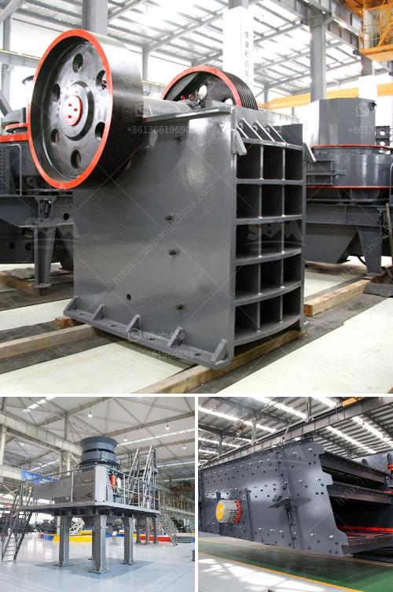

<h3>cost of crusher machine in ethiopia</h3>
The demand for construction machinery in Ethiopia is continually growing. With the booming infrastructure sector, the need for high-quality crushers is paramount. Purchasing an efficient stone crusher machine in Ethiopia can significantly reduce your operating and maintenance costs.

This transformative equipment increases your working efficiency and maximizes the return on your investment. The cost of purchasing this machine ranges depending on several factors, including its size, power, and capacity. The larger the machine, the higher the cost. Moreover, the brand of the crusher machine also determines its cost. Numerous renowned brands offer high-quality crushers, but at a higher price point.

However, investing in a crusher machine is a wise choice for construction companies. They understand that these machines can provide immense benefits, including faster project completion, higher productivity, and reduced manpower costs. Additionally, the crusher machine increases the company's reputation by consistently delivering high-quality aggregates for construction projects.

The cost ranges between $20,000 to $30,000 for a small-sized crusher machine, while a large-sized crusher machine costs around $60,000 to $90,000. The cost of purchasing a crusher machine includes not only the machine itself but also other costs, such as installation, maintenance, and repairs.

To save on overall costs, it is vital to choose a machine that matches your specific requirements. Take into consideration your desired output capacity, material requirements, and available budget. Conducting thorough research and comparing different suppliers can help you find a reliable and cost-effective crusher machine in Ethiopia.

In conclusion, the cost of purchasing a crusher machine in Ethiopia varies depending on multiple factors, such as size, power, capacity, and brand. However, investing in this equipment is crucial for construction companies as it brings numerous benefits, including increased productivity and efficiency. Carefully analyze your requirements and budget to select the most suitable crusher machine and ensure a higher return on investment.
<h3>Contact us</h3><ul><li><strong>Whatsapp:&nbsp;<a href="https://wa.me/8613661969651">+8613661969651</a></strong></li><li><a href="https://swt.shibang-china.com/?git&amp;zhl&amp;cost of crusher machine in ethiopia"><strong>Online Service(chat now)</strong></a></li></ul><h3>Related</h3><ul><li><a href='construction equipment feasibility study.md'>construction equipment feasibility study</a></li><li><a href='grinder mill in bolivia.md'>grinder mill in bolivia</a></li><li><a href='metal detector for iron ore crushing plant.md'>metal detector for iron ore crushing plant</a></li><li><a href='price of mining conveyor belt in south africa.md'>price of mining conveyor belt in south africa</a></li><li><a href='hammer mill for sale ebay.md'>hammer mill for sale ebay</a></li></ul>