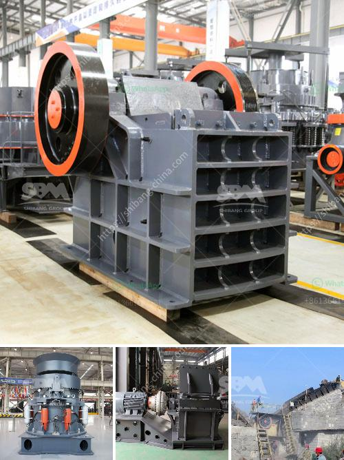

<h3>cost of gold beneficiation plant</h3>
Gold beneficiation plant refers to the processing of gold ore to obtain gold concentrates. The beneficiation process involves crushing, grinding, flotation, leaching, and other methods to extract gold from its ores. With the ever-increasing demand for gold, investors have targeted gold beneficiation plants as a profitable investment option. However, building a gold beneficiation plant involves significant costs that must be carefully considered.

The cost of a gold beneficiation plant can vary widely depending on the complexity, scale, and location of the project. Several factors contribute to the overall cost, including equipment, labor, and infrastructure expenses. Let's break down these factors to understand the cost implications involved.

The equipment required for a gold beneficiation plant includes crushers, grinding mills, flotation cells, leaching tanks, and other processing units. These equipment costs can range from thousands to millions of dollars, depending on their quality, capacity, and efficiency. It is essential to choose reliable and cost-effective equipment to ensure a successful project within budget.

A gold beneficiation plant requires skilled labor to operate and manage various processes efficiently. Labor costs can form a significant part of the total project cost, especially when experienced professionals are hired. To minimize labor costs, some companies prefer to hire local talent or provide adequate training to the existing workforce. Careful consideration should be given to labor expenses to ensure their sustainability during the project's lifetime.

The construction of a gold beneficiation plant necessitates the establishment of necessary infrastructure, such as access roads, power supply, water treatment facilities, and waste management systems. These infrastructural expenses can add considerably to the overall project cost. The remoteness of the project location can increase transportation and logistics costs, making it crucial to choose a location that balances project requirements and cost efficiencies.

Gold beneficiation plants must adhere to various regulatory and environmental standards. Compliance with these requirements can incur additional costs associated with obtaining permits, conducting feasibility studies, environmental impact assessments, and implementing sustainable practices. Investors must consider these costs to avoid potential liabilities and ensure responsible mining practices.

Apart from initial capital costs, gold beneficiation plants have ongoing operational expenses. These include costs associated with ongoing maintenance, chemicals, utilities, and labor. Estimating and planning for these operating expenses is vital to determine the overall project's financial viability and profitability.

Despite the initial capital investments and ongoing operational expenses, constructing and operating a gold beneficiation plant can be a lucrative investment opportunity in the long run. Gold's enduring value and market demand make it an attractive option for investors seeking sustainable returns. However, thorough research, feasibility studies, and financial planning are crucial before embarking on such a venture.

In conclusion, the cost of a gold beneficiation plant depends on several factors such as equipment, labor, infrastructure, regulatory compliance, and ongoing operational expenses. Investors should carefully analyze these cost implications alongside potential returns to make an informed decision. With proper planning and careful execution, a well-designed gold beneficiation plant can yield significant financial rewards while upholding environmental and social responsibilities.
<h3>Contact us</h3><ul><li><strong>Whatsapp:&nbsp;<a href="https://wa.me/8613661969651">+8613661969651</a></strong></li><li><a href="https://swt.shibang-china.com/?git&amp;zhl&amp;cost of gold beneficiation plant"><strong>Online Service(chat now)</strong></a></li></ul><h3>Related</h3><ul><li><a href='100tph stone crusher sale in south africa.md'>100tph stone crusher sale in south africa</a></li><li><a href='crushing plant in pakistan.md'>crushing plant in pakistan</a></li><li><a href='dolomite stone crusher plant.md'>dolomite stone crusher plant</a></li><li><a href='hammers mill machine.md'>hammers mill machine</a></li><li><a href='calcium carbonate making machinery in germany.md'>calcium carbonate making machinery in germany</a></li></ul>