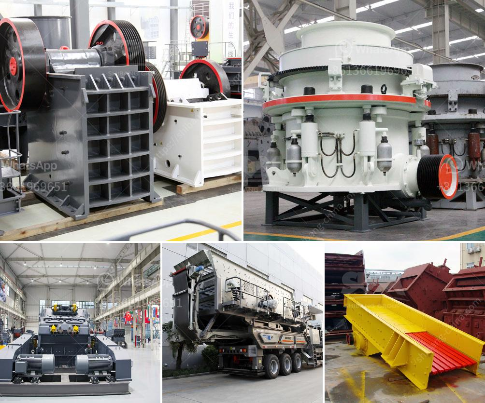

<h3>cost of granite crusher</h3>
Granite is a common type of igneous rock that is used as building material or for countertops in kitchens and bathrooms. It is known for its durability, strength, and aesthetic appeal. To transform granite into usable crushed stone, a granite crusher is required. In this article, we will explore the cost of a granite crusher.

The cost of a granite crusher can vary depending on the model, capacity, and brand. On average, the price of a granite crusher ranges from $100,000 to $1 million. Factors such as the size of the granite deposit and the production capacity required also influence the final cost.

One of the key factors that affect the cost of a granite crusher is its capacity. Crushers with higher capacity tend to be more expensive than those with lower capacity. This is because larger crushers require more powerful motors and more robust construction materials to handle the increased workload. Additionally, high-capacity crushers can process more granite per hour, resulting in increased productivity.

Another factor that affects the cost of a granite crusher is the type of crusher. There are various types of crushers available in the market, including jaw crushers, impact crushers, cone crushers, and gyratory crushers. Each type has its own advantages and disadvantages, and their prices can vary accordingly. For example, jaw crushers are generally cheaper than cone crushers, but they may have limited capacity and produce larger particle sizes.

The brand of the granite crusher can also influence its cost. Well-known and reputable brands tend to have higher prices due to their established reputation, quality craftsmanship, and after-sales support. However, lesser-known brands may offer more affordable options without compromising on quality. It is essential to research and compare different brands to find the one that suits your requirements and budget.

Apart from the upfront cost of the granite crusher, it is crucial to consider the operating and maintenance costs. Some crushers may require regular maintenance, replacement parts, or lubricants, which can add to the overall cost. Additionally, the energy consumption of the crusher should also be taken into account. Energy-efficient crushers can help reduce electricity bills and minimize environmental impact.

When purchasing a granite crusher, it is advisable to consult with experts or professionals in the industry. They can provide valuable insights and help you make an informed decision. Furthermore, obtaining multiple quotes from different suppliers can help you compare prices and negotiate a better deal.

In conclusion, the cost of a granite crusher can vary depending on several factors, including its capacity, type, brand, and operational expenses. It is crucial to consider these factors and conduct thorough research before making a purchase. By doing so, you can ensure that you get the most cost-effective solution that meets your needs while maintaining the quality and durability of the granite crusher.
<h3>Contact us</h3><ul><li><strong>Whatsapp:&nbsp;<a href="https://wa.me/8613661969651">+8613661969651</a></strong></li><li><a href="https://swt.shibang-china.com/?git&amp;zhl&amp;cost of granite crusher"><strong>Online Service(chat now)</strong></a></li></ul><h3>Related</h3><ul><li><a href='ball mill cost for 100ton cement plant.md'>ball mill cost for 100ton cement plant</a></li><li><a href='silica sand washing process.md'>silica sand washing process</a></li><li><a href='used portable stone crusher machine for sale usa.md'>used portable stone crusher machine for sale usa</a></li><li><a href='nirani cement plant.md'>nirani cement plant</a></li><li><a href='jaw and cone crusher.md'>jaw and cone crusher</a></li></ul>