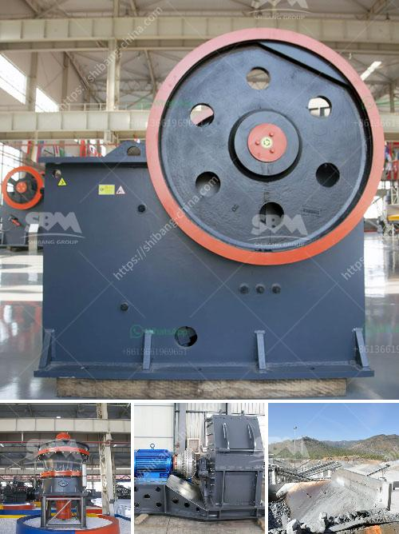

<h3>cost of setting up mini cement plant</h3>
Setting up a mini cement plant is not as straightforward as one might think. There are several factors that need to be considered in order to determine the total cost of setting up a mini cement plant. These include the price of the machinery, land, labor costs, raw materials, and other expenses. 

The machinery required for a mini cement plant includes crushers, grinders, cement kilns, coolers, and conveyors, among others. The price of these machines varies depending on their capacity and features. Additionally, the location of the plant and the availability of skilled labor can also impact the cost. 

Land is another important consideration when setting up a mini cement plant. The cost of acquiring land will depend on the location and the size of the plant. It is important to choose a location that is close to the market to minimize transportation costs.

Labor costs are another significant expense. Skilled labor is required to operate and maintain the machinery, as well as carry out other activities in the plant. The availability of skilled labor and prevailing wages in the area will impact the overall cost.

Raw materials, such as limestone, clay, and gypsum, are essential for cement production. The availability and prices of these materials will affect the cost of setting up the plant. Transportation costs for these materials should also be taken into account.

In addition to these expenses, there are other costs involved in setting up and running a mini cement plant, such as permits, licenses, and insurance. These costs can vary depending on the regulations and requirements of the specific location.

Considering all these factors, it is difficult to estimate a specific cost for setting up a mini cement plant. However, based on industry estimates, the total cost of setting up a plant with a capacity of 50,000 tonnes per annum would be around $1.5 million to $2 million. This includes land, machinery, and other operational expenses. However, the cost can be higher for smaller capacity plants or lower for larger capacity plants.

It is important to conduct a detailed feasibility study before investing in a mini cement plant. This study will help in determining the total cost, as well as the viability and profitability of the venture. It is also advisable to consult experts and professionals in the cement industry to get accurate estimates and guidance.
<h3>Contact us</h3><ul><li><strong>Whatsapp:&nbsp;<a href="https://wa.me/8613661969651">+8613661969651</a></strong></li><li><a href="https://swt.shibang-china.com/?git&amp;zhl&amp;cost of setting up mini cement plant"><strong>Online Service(chat now)</strong></a></li></ul><h3>Related</h3><ul><li><a href='cone crusher instructions.md'>cone crusher instructions</a></li><li><a href='crusher plants in pakistan.md'>crusher plants in pakistan</a></li><li><a href='south africa mobile crusher.md'>south africa mobile crusher</a></li><li><a href='stone crusher kapasitas.md'>stone crusher kapasitas</a></li><li><a href='crusher sri lanka.md'>crusher sri lanka</a></li></ul>