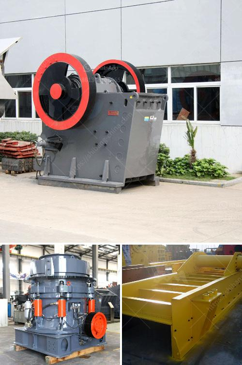

<h3>cost of stone crusher in nigeria</h3>
Stone crusher is widely used in mining, metallurgical, construction, chemistry, petrochemicals, transportation, energy, building materials industry, suitable for crushing high hard, mid hard and soft rocks and ores such as iron ore, limestone, slag, marble, quartz, granite, cement, clinker and so on.

Stone crushers are typically used as primary crushers, or the first step in the process of reducing rock. They typically crush using compression. The rock is dropped between two rigid pieces of metal, one of which then move inwards towards the rock, and the rock is crushed because it has a lower breaking point than the opposing metal piece.

Jaw stone crusher is designed to crush hard material at higher speed with minimum of power and maintenance. The crusher is designed on advance principal of “Crushing without Rubbing” with high impact pressure. There are two types: coarse crushing and fine crushing, it will be the ideal equipment for primary crushing.

Jaw crusher is widely used in mine, metallurgy, the building, road and railroad construction, hydraulic construction, chemical industry, fire-proofing material and ceramics.

Cone crusher is the upgraded version of the gyratory crusher, it can be used for crushing medium-hard or extra-hard materials, and has the advantages of low operation cost, convenient adjustment, and economical use.

The cost of stone crusher in Nigeria has always been a concern for customers. The cost of stone crusher in Nigeria is usually affected by many factors, such as the type of stone crusher, location, specific crusher manufacturer, etc.

Nigeria has a large population and a high population growth rate. The demand for construction materials can be found virtually everywhere, which makes starting a stone crushing business a promising venture.

For instance, the cost of crusher plants with different capacities vary greatly. The cost of stone crusher plant is also different between single stone crusher and full crusher screen line. The full stone crusher line includes stone crusher, vibrating screen, vibrating feeder, belt conveyor, etc, which is widely used for the medium and large scale stone crushing in mining, quarry, construction, road pavement, highway and other industries. It will be about 40,000-200,000 dollars.

The detailed cost of stone crusher plant is decided by the specific product configuration. Taking a typical 50 tph stone crusher plant for example, one of our customers would like to buy a stone crusher plant with tph capacity, raw materials are feed by vibrating feeder in to jaw crusher PE750*1060 whose capacity can be up to 52-180 tph. Secondary crushing equipment is impact crusher PF1214 whose capacity is 80-140 tph. For screening materials for different sizes, vibrating screen is playing its role.

Customers can adjust the size of their final products from this stone crushing plant. Clients will get the satisfactory products after objects being crushed for several times. Dust is generated during the working process while the dust control units are needed.

In conclusion, the cost of stone crusher in Nigeria is usually affected by many factors, including the type and model, manufacturer, market, supply and demand, as well as the economic and social environment. The stone crusher in Nigeria is usually used to crush cars, stones, marble, ceramics, basalt, chrome, dolomite, feldspar, fluorite, kaolin ore, marble, granite, iron ore, copper ore, gold ore, limestone and so on. There are many different types of stone crusher machine at sale in market, made from SBM, such as jaw crusher, impact crusher, cone crusher as well as mobile crusher and so on.
<h3>Contact us</h3><ul><li><strong>Whatsapp:&nbsp;<a href="https://wa.me/8613661969651">+8613661969651</a></strong></li><li><a href="https://swt.shibang-china.com/?git&amp;zhl&amp;cost of stone crusher in nigeria"><strong>Online Service(chat now)</strong></a></li></ul><h3>Related</h3><ul><li><a href='cone crusher manufacturer in south africa.md'>cone crusher manufacturer in south africa</a></li><li><a href='supplier of vibrating screen in philippines.md'>supplier of vibrating screen in philippines</a></li><li><a href='rental crusher rinda.md'>rental crusher rinda</a></li><li><a href='design of harmer mill.md'>design of harmer mill</a></li><li><a href='cement grinding units in india basalt crusher quotes.md'>cement grinding units in india basalt crusher quotes</a></li></ul>