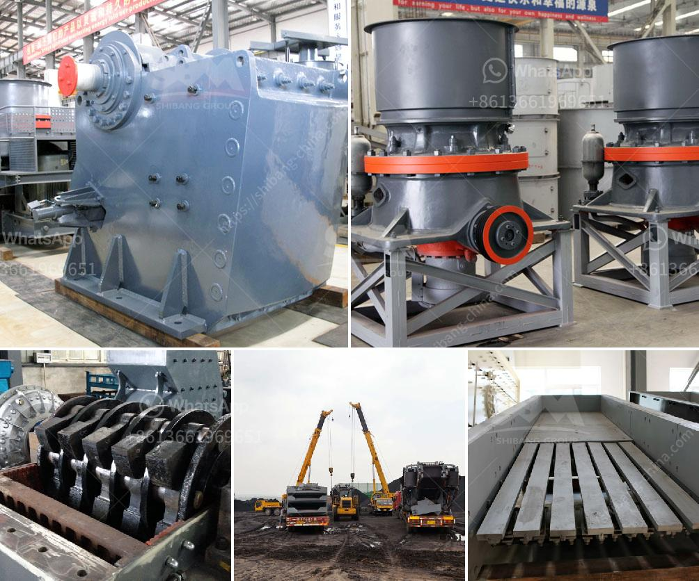

<h3>cost of the process of mining limestone</h3>
Limestone is a common mineral found all over the world. However, extracting this resource can be quite costly in terms of both money and environmental impact. Most limestone mining operations are established in rural areas near deposits of limestone, which can help reduce the cost of transportation and provide job opportunities for local communities.

However, the environmental impact of limestone mining can be detrimental. Mining activities often result in the destruction of natural habitats and can lead to the contamination of groundwater and surface water due to the use of chemicals. Additionally, the noise and dust generated by mining machinery can be disruptive to nearby communities.

The cost of the mining process is highly dependent on the scale of the operation. The larger the operation, the more expensive it is to extract limestone. In general, underground mining is more costly than surface mining. Regardless of the method used, a significant amount of resources is required to extract limestone, including heavy machinery, drilling equipment, explosives, and manpower.

The cost of mining limestone also includes geological assessment and mine planning. The process of analyzing the composition of the deposit to determine the most suitable method of extraction can be time-consuming and expensive. It involves conducting surveys and studies to understand the quality and quantity of the limestone deposit and its suitability for mining.

Operating costs are also a significant factor in the overall cost of limestone mining. These costs include expenses related to labor, utilities, maintenance, and regulatory compliance. Mining companies must comply with numerous regulations and safety standards, which can increase the cost of operations.

Moreover, transportation costs can add to the overall expense of mining limestone. Once extracted, the limestone needs to be transported to processing plants or to construction sites. Long-distance transportation can be costly due to fuel expenses and logistical challenges.

In conclusion, the cost of mining limestone can vary greatly depending on various factors such as the scale of the operation, the method used, geological assessment, operating expenses, and transportation costs. While limestone is a valuable resource that contributes to various industries, it is essential to consider the environmental impact and ensure responsible mining practices are followed to minimize the costs to both the economy and the environment.
<h3>Contact us</h3><ul><li><strong>Whatsapp:&nbsp;<a href="https://wa.me/8613661969651">+8613661969651</a></strong></li><li><a href="https://swt.shibang-china.com/?git&amp;zhl&amp;cost of the process of mining limestone"><strong>Online Service(chat now)</strong></a></li></ul><h3>Related</h3><ul><li><a href='cost of a small scale cement plant in india.md'>cost of a small scale cement plant in india</a></li><li><a href='movable stone crusher.md'>movable stone crusher</a></li><li><a href='production of stone crusher.md'>production of stone crusher</a></li><li><a href='movable conveyor belt.md'>movable conveyor belt</a></li><li><a href='tracked crushers for sale south africa.md'>tracked crushers for sale south africa</a></li></ul>