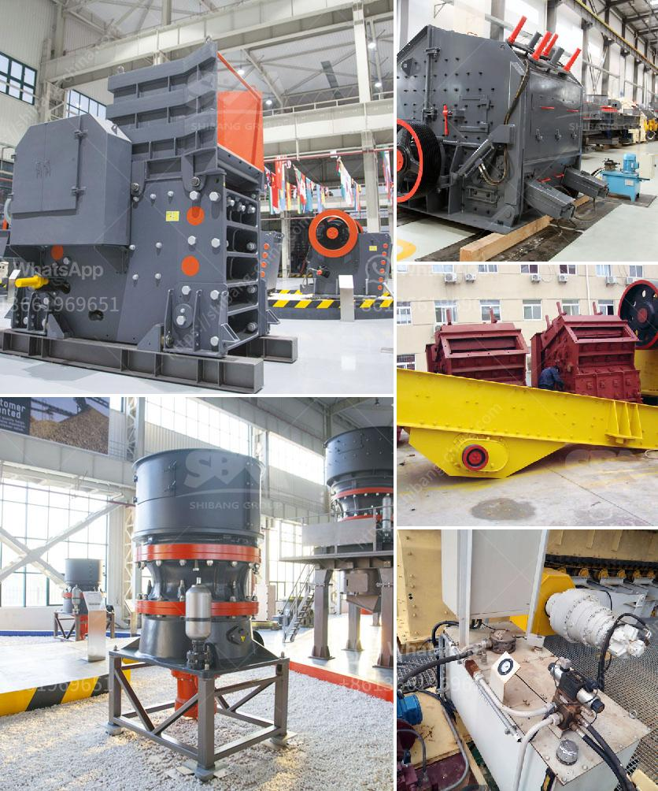

<h3>cost required for mini cement plant</h3>
A mini cement plant is a small-scale production unit that requires a small amount of capital investment to set up. It can cater to the demands of small-scale cement manufacturing plants and is perfect for startups. Before delving into the cost required for the setup of a mini cement plant, it is important to understand the essentials of a mini cement plant.

A mini cement plant consists of various processes, such as raw material preparation, raw material grinding, clinker grinding, cement grinding, and packing. The raw materials used in the production of cement include limestone, clay, iron ore, and coal, etc. Limestone is the main raw material for cement production, and it is extracted from the open-cast mine by blasting or by using excavators and loaders.

The cost of setting up a mini cement plant varies depending on various factors, such as the capacity of the plant, the location of the project, the raw materials required, the transportation cost, the availability of labor and machinery, etc. However, the average initial capital cost to set up a mini cement plant is estimated to be around $150-200 million.

The cost required to set up a mini cement plant is primarily related to the cost of machinery and equipment, land, and construction expenses. Some of the major components required for setting up a mini cement plant are:

1. Land: A mini cement plant requires a minimum land area of around 3 acres for setting up the facility. The land needs to be contiguous and should have the necessary infrastructure.

2. Machinery and Equipment: The machinery and equipment required for a mini cement plant include crushers, conveyors, cement mill, preheater, separator, rotary kiln, and dust collector, etc. The machinery and equipment have an estimated cost of around $50 million, which varies based on the capacity of the plant.

3. Raw Materials: The raw materials required for cement production, such as limestone, clay, iron ore, and coal, need to be procured. The cost of raw materials may vary depending on the availability and location of the mine or quarry.

4. Construction Expenses: The construction costs include civil work, electrical work, and plumbing work, among others. The construction expenses are estimated to be around $30-40 million.

5. Utilities: Utilities such as water supply, electricity, and fuel also contribute to the overall cost of setting up a mini cement plant.

Considering these factors, the total cost required for setting up a mini cement plant with a capacity of 200-300 tons per day will be around $150-200 million. However, it is important to note that these figures are rough estimates and can vary depending on various factors.

In conclusion, setting up a mini cement plant requires a significant amount of capital investment. The cost primarily depends on the capacity of the plant, the machinery and equipment required, as well as other factors such as land availability and construction expenses. It is essential to conduct a detailed feasibility study and project report to assess the overall cost and viability of setting up a mini cement plant.
<h3>Contact us</h3><ul><li><strong>Whatsapp:&nbsp;<a href="https://wa.me/8613661969651">+8613661969651</a></strong></li><li><a href="https://swt.shibang-china.com/?git&amp;zhl&amp;cost required for mini cement plant"><strong>Online Service(chat now)</strong></a></li></ul><h3>Related</h3><ul><li><a href='prices for sand washer on sale in india.md'>prices for sand washer on sale in india</a></li><li><a href='coal conveyor manufacturer germany.md'>coal conveyor manufacturer germany</a></li><li><a href='stone crusher price of 30 tons per hour.md'>stone crusher price of 30 tons per hour</a></li><li><a href='granite quarry business plan pdf.md'>granite quarry business plan pdf</a></li><li><a href='used small stone crusher mill california.md'>used small stone crusher mill california</a></li></ul>