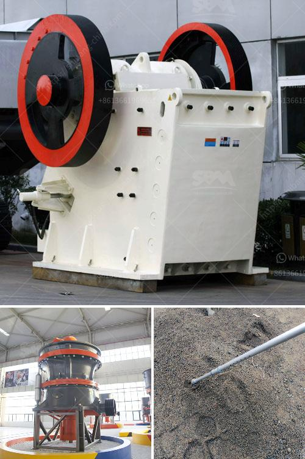

<h3>cost to open a mini cement plant</h3>
The cement industry is a highly competitive field, and opening a mini cement plant can be a tricky endeavor. There are several factors to consider when evaluating the cost of setting up a cement plant. However, if planned efficiently, it can become a lucrative business venture.

One of the first steps in starting a cement plant is obtaining the necessary licenses and permits. This process can be time-consuming and may involve dealing with multiple government agencies. The cost of obtaining these licenses and permits can vary depending on the location and regulatory requirements.

Next comes finding a suitable location for the mini cement plant. It is essential to select a site that is close to raw materials like limestone, clay, and gypsum, which are essential ingredients in cement production. Transporting these materials can be expensive, so proximity to the source is crucial. Additionally, the plant should be situated near its target market to minimize transportation costs.

The next major expense is the procurement of machinery and equipment. This includes crushers, kilns, mixers, and conveyors, among other things. The cost of equipment will depend on the production capacity of the plant. A mini cement plant typically has a production capacity ranging from 50 to 100 tons per day. Purchasing second-hand machinery may reduce costs, but careful inspection is necessary to ensure its efficiency and reliability.

The initial investment also includes the cost of constructing the plant and infrastructure. This may involve erecting buildings, constructing roads, laying pipelines, and installing electrical systems. The cost of construction materials and labor must be considered to determine a realistic budget.

Another crucial aspect to consider is the availability and cost of skilled labor. Cement production requires a skilled workforce, including engineers, technicians, and operators. The cost of hiring and training employees should be factored into the budget.

In addition to the initial investment, ongoing operational costs must be accounted for. These costs can include electricity, fuel, maintenance, raw material sourcing, and distribution expenses. Prioritizing energy-efficient technologies and optimizing production processes can help reduce these expenses and increase profitability.

Marketing and distribution strategies will also impact the cost of running a mini cement plant. Building a strong network of suppliers and customers is essential for a successful business. Developing relationships with construction companies, contractors, and distributors will help ensure a steady demand for the cement produced.

Before setting up a mini cement plant, it is crucial to conduct a comprehensive feasibility study. This study will evaluate the market demand, competition, profitability, and potential challenges. It will provide a realistic estimate of the investment required and the expected return on investment.

In conclusion, opening a mini cement plant involves significant financial investment. The costs can vary depending on several factors such as location, production capacity, machinery procurement, labor, and ongoing operational expenses. However, with meticulous planning and strategic decision-making, a well-managed mini cement plant can become a profitable venture in the construction industry.
<h3>Contact us</h3><ul><li><strong>Whatsapp:&nbsp;<a href="https://wa.me/8613661969651">+8613661969651</a></strong></li><li><a href="https://swt.shibang-china.com/?git&amp;zhl&amp;cost to open a mini cement plant"><strong>Online Service(chat now)</strong></a></li></ul><h3>Related</h3><ul><li><a href='feasibility study of cement plant.md'>feasibility study of cement plant</a></li><li><a href='sample business plan for stone crusher.md'>sample business plan for stone crusher</a></li><li><a href='mobile crushers ghana.md'>mobile crushers ghana</a></li><li><a href='slag crusher plant manufacturer india.md'>slag crusher plant manufacturer india</a></li><li><a href='crushing complete crushing plant 150tph 200tph.md'>crushing complete crushing plant 150tph 200tph</a></li></ul>