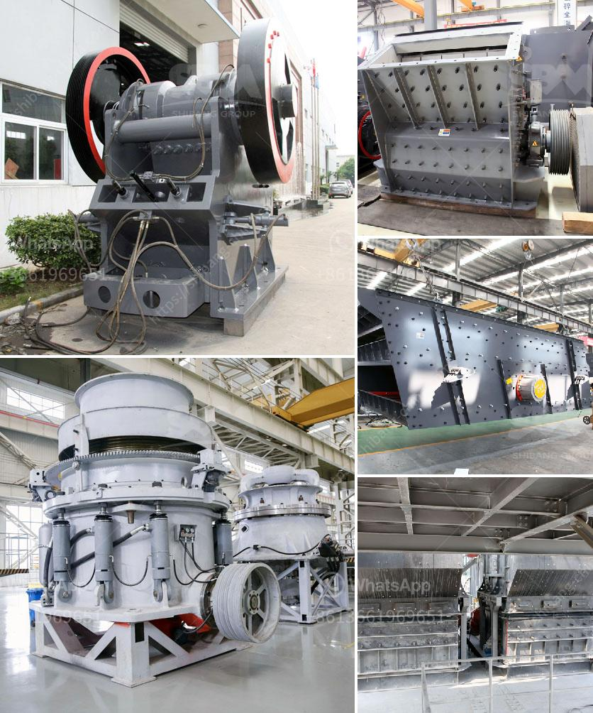

<h3>cost to setup mini cement plant in india</h3>
The Indian cement industry is the second largest in the world, and it plays a pivotal role in the infrastructure development of the country. India's economic growth and increasing urbanization have led to a surge in demand for cement, making it a lucrative business opportunity for entrepreneurs.

If you are considering setting up a mini cement plant in India, several factors need to be taken into account, including the location, market demand, and project cost. Let's explore the estimated cost to set up a mini cement plant.

Firstly, the location of the plant plays a crucial role in determining the overall project cost. The availability of raw materials, such as limestone and coal, transportation costs, and proximity to the market are significant factors to consider.

A mini cement plant typically requires a minimum of 100 acres of land and should ideally be located near a railway line, which reduces transportation costs. Additionally, the availability of limestone deposits or quarries in proximity to the plant site is essential, as limestone is the primary raw material for cement production.

The market demand is another critical aspect to evaluate before setting up a mini cement plant. It is necessary to study the cement industry trends, market potential, and future growth prospects to ensure a sustainable and profitable business.

Next, let's discuss the cost elements involved in setting up a mini cement plant. The cost of land, machinery, raw materials, labor, and other infrastructure constitute the major portion of the project cost. It is important to have a detailed cost analysis to accurately estimate the expenses.

Land: The cost of acquiring land varies depending on the location and size of the plant. It is advisable to look for land options that offer good connectivity and are cost-effective. The average cost of land could range from INR 2-5 crores per acre.

Machinery: The machinery needed for cement manufacturing includes crushers, kiln, cooler, cement mill, conveyor belts, and other equipment. The cost of machinery can range from INR 75-200 crores, depending on the capacity and technology.

Raw Materials: The major raw material required for cement production is limestone. The cost of procuring this raw material depends on its availability and distance from the plant site. Generally, the cost of raw materials can range from INR 100-400 crores.

Infrastructure: Setting up a mini cement plant requires various infrastructure facilities, including power supply, water availability, and transport access. The cost of infrastructure development can vary significantly based on the site conditions and location.

Labor: Skilled and unskilled labor is required for the operation of the mini cement plant. The cost of labor depends on the wage rates prevailing in the region and the number of employees hired.

Miscellaneous: Other costs, including administrative expenses, legal fees, permits, insurance, and marketing, also need to be considered when estimating the project cost.

In conclusion, setting up a mini cement plant in India involves substantial investment. The estimated cost can range from INR 200-500 crores, depending on various factors such as location, market demand, raw material availability, machinery, and infrastructure. Conducting a detailed feasibility study and having a comprehensive business plan are essential before embarking on this venture.
<h3>Contact us</h3><ul><li><strong>Whatsapp:&nbsp;<a href="https://wa.me/8613661969651">+8613661969651</a></strong></li><li><a href="https://swt.shibang-china.com/?git&amp;zhl&amp;cost to setup mini cement plant in india"><strong>Online Service(chat now)</strong></a></li></ul><h3>Related</h3><ul><li><a href='law requirements in stone crushing industry.md'>law requirements in stone crushing industry</a></li><li><a href='stone crusher punjab ropar.md'>stone crusher punjab ropar</a></li><li><a href='stone quarry machines.md'>stone quarry machines</a></li><li><a href='used roller mills for sale.md'>used roller mills for sale</a></li><li><a href='study of a fero chrome crushing plant.md'>study of a fero chrome crushing plant</a></li></ul>