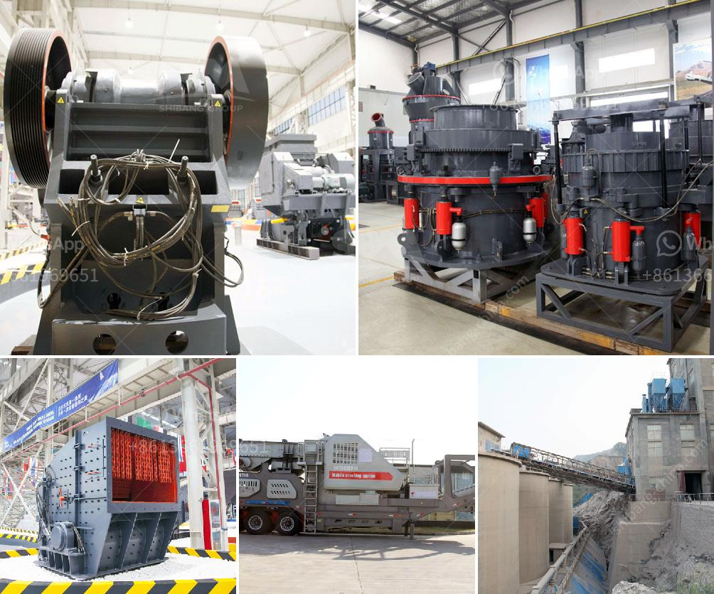

<h3>cpc 75 tph stone crusher price in ranchi</h3>
In recent years, the Indian construction industry has been witnessing a significant growth, fueled by the government's ambitious infrastructure development plans. This has led to a surge in demand for high-quality building materials such as stones and minerals. To cater to this demand, various stone crushing units have been set up in different parts of the country.

One such company that has been serving the construction industry for quite some time now is CPC Equipments Pvt. Ltd. We are based in Ranchi and aim to provide our clients with top-notch stone crushing equipment at competitive prices. Our extensive range of machines includes robust and efficient jaw crushers, cone crushers, and vertical shaft impactors.

Amongst the wide variety of crushers, our CPC 75 TPH Stone Crusher stands out for its sturdy construction, high productivity, and reliability. The advanced design of the machine ensures a smooth and trouble-free operation, making it easier for our customers to achieve maximum productivity and meet their project deadlines.

When it comes to pricing, we understand the importance of offering a competitive rate to our customers. At CPC Equipments Pvt. Ltd., we strive to provide cost-effective solutions without compromising on the quality of our products. The CPC 75 TPH Stone Crusher is priced between INR 12.5 lakhs and 15 lakhs, depending on the configuration and specifications.

In addition to our competitive prices, we also offer excellent after-sales services to ensure customer satisfaction. Our team of skilled technicians are always available to assist our clients with any queries or issues that they may have.

To sum it up, if you are in Ranchi and in need of a reliable stone crusher, look no further than CPC Equipments Pvt. Ltd. Our CPC 75 TPH Stone Crusher offers optimal performance at a competitive price, making it the preferred choice for many in the construction industry. Contact us today to discuss your requirements and let us assist you in finding the perfect crushing solution for your next project.
<h3>Contact us</h3><ul><li><strong>Whatsapp:&nbsp;<a href="https://wa.me/8613661969651">+8613661969651</a></strong></li><li><a href="https://swt.shibang-china.com/?git&amp;zhl&amp;cpc 75 tph stone crusher price in ranchi"><strong>Online Service(chat now)</strong></a></li></ul><h3>Related</h3><ul><li><a href='sand dry vacuum machine truk.md'>sand dry vacuum machine truk</a></li><li><a href='marble crusher price.md'>marble crusher price</a></li><li><a href='vsi crusher for crush sand.md'>vsi crusher for crush sand</a></li><li><a href='raymond mill for grinding gypsum.md'>raymond mill for grinding gypsum</a></li><li><a href='concrete crusher in kenya for sale.md'>concrete crusher in kenya for sale</a></li></ul>