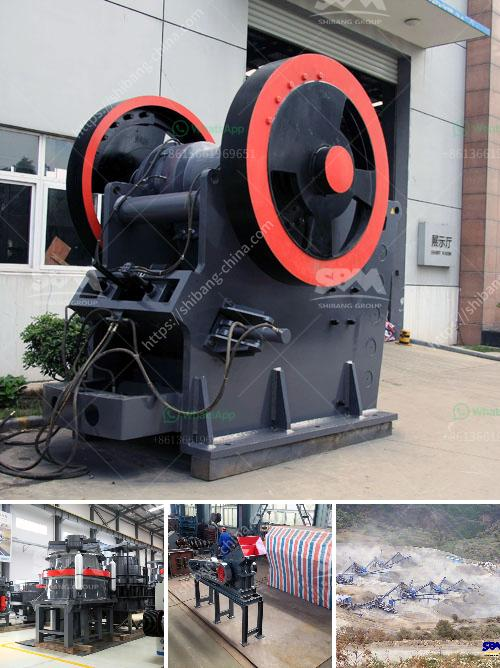

<h3>crossley economy x ball mill</h3>
The Crossley Economy X Ball Mill is a high-fidelity machine for grinding, mixing, and reducing materials to a granular product. The mill features a cylindrical tank with grinding medium (balls) made of diverse materials that can reliably ensure consistent performance. The operation of this ball mill is based on impact and attrition principles, which ensure effective size reduction and dispersion of materials.

One of the key advantages of the Crossley Economy X Ball Mill is its compact design, which allows it to fit into small spaces and be easily integrated into various processing lines. This feature makes it ideal for both laboratory and industrial applications, where space may be limited but high-quality grinding is required.

Another notable feature of this mill is its variable speed drive that allows operators to control the rotational speed of the mill. This capability is crucial for optimizing the efficiency of grinding and achieving the desired particle size distribution. With this flexibility, one can process various materials of different hardness and brittleness, ensuring superior results compared to fixed-speed milling machines.

The Crossley Economy X Ball Mill is built with durability in mind. The tank and the internal parts are made of wear-resistant materials, which prolongs the equipment's lifespan and reduces maintenance costs. Additionally, the mill is equipped with a reliable and efficient drive system that ensures smooth and consistent operation, minimizing downtime and maximizing productivity.

In terms of safety, the Crossley Economy X Ball Mill comes with safety guards and features an emergency stop button, which allows operators to quickly halt the operation in case of any unforeseen circumstances. Moreover, the mill is equipped with an advanced control system that constantly monitors and regulates critical parameters, ensuring the safety of the equipment and personnel.

The versatility of the Crossley Economy X Ball Mill is further enhanced by its ability to process a wide range of materials. It is suitable for grinding and mixing various types of minerals, ores, chemicals, and other materials. Whether it is for preparing samples in a laboratory or for large-scale production, this ball mill can handle different material specifications, ensuring consistent and accurate results.

In conclusion, the Crossley Economy X Ball Mill is a reliable and efficient machine for grinding, mixing, and reducing materials to a granular product. Its compact design, variable speed drive, and durable construction make it a versatile choice for various industries. Whether in the laboratory or industrial setting, this mill can tackle different materials and deliver high-quality results. With its safety features and advanced control system, operators can have peace of mind while achieving their desired grinding objectives.
<h3>Contact us</h3><ul><li><strong>Whatsapp:&nbsp;<a href="https://wa.me/8613661969651">+8613661969651</a></strong></li><li><a href="https://swt.shibang-china.com/?git&amp;zhl&amp;crossley economy x ball mill"><strong>Online Service(chat now)</strong></a></li></ul><h3>Related</h3><ul><li><a href='sells vibrating screens for gravel sand.md'>sells vibrating screens for gravel sand</a></li><li><a href='industrial ball mills.md'>industrial ball mills</a></li><li><a href='sewa mobil crusher di kaltim.md'>sewa mobil crusher di kaltim</a></li><li><a href='vertical grinder mill for sale.md'>vertical grinder mill for sale</a></li><li><a href='jaw crusher company.md'>jaw crusher company</a></li></ul>