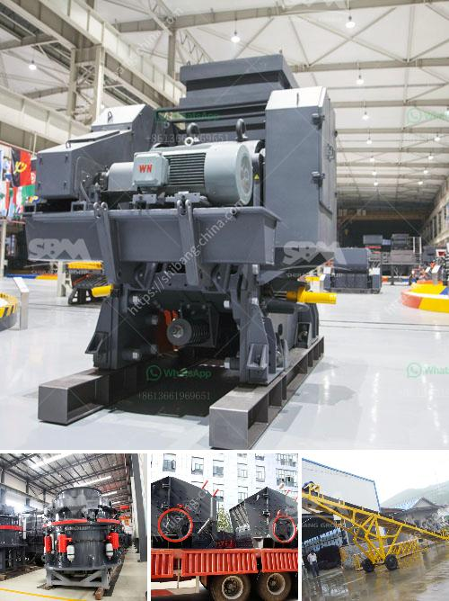

<h3>crusher and screen for sale philippines</h3>
Crusher and Screen for Sale Philippines: A Vital Component in Construction, Mining, and Aggregate Industries

When it comes to construction, mining, and aggregate industries, several vital components are necessary for completing quality projects. This is why these industries gravitate towards the use of heavy machinery. With the availability of various types of machinery, choosing the most suitable equipment for your project becomes crucial.

Two essential pieces of equipment that play a significant role in these industries are crushers and screens. These machines work together to break down larger rocks into smaller, more manageable sizes.

Crushers are designed to process large rocks into smaller particles that can be used for various purposes such as road base, construction aggregates, and even landscaping materials. They are categorized into different types based on their principle of operation. Some of the common types include jaw crushers, cone crushers, impact crushers, and gyratory crushers.

Screens, on the other hand, are used to separate the crushed materials into different sizes. They come in various configurations, such as vibrating screens, trommel screens, and grizzly screens. The choice of screen depends on the application and the size range of the desired end product.

In the Philippines, these machines are crucial for the success of the construction, mining, and aggregate industries. Indeed, crushers and screens are integral to these industries and often come as a package deal.

Buying a crusher and screen for sale Philippines is not only for construction and mining purposes. These machines are also used in the recycling industry, where they are used to process a variety of materials including plastics, rubber, glass, and even electronic waste.

When considering the purchase of a crusher and screen for sale Philippines, there are certain factors to keep in mind. Firstly, it is essential to choose a reliable manufacturer or supplier that offers quality machinery. Quality machines ensure productivity, durability, and longevity.

Secondly, the specific needs of the project should be considered. Different crushers and screens are designed for different applications. Assessing the requirements of the project, such as the desired end product size, capacity, and material type, will help in choosing the right machinery.

Furthermore, the size of the equipment should also be taken into account. The available space in the project area should be considered when selecting the appropriate size of the crusher and screen.

In addition, it is advisable to consider the after-sales services offered by the manufacturer or supplier. Maintenance and repairs are a part of the life cycle of these machines. Choosing a supplier that provides excellent after-sales support will ensure that your equipment runs smoothly and efficiently.

In conclusion, crusher and screen for sale Philippines is a vital component in the construction, mining, and aggregate industries. These machines are used to break down and separate larger rocks into smaller, more manageable sizes to facilitate efficient operations. When considering the purchase of these machines, it is crucial to choose a reliable manufacturer or supplier, assess project needs, and consider the available space and after-sales services. With the right crusher and screen, projects can be completed with precision and efficiency, leading to successful outcomes.
<h3>Contact us</h3><ul><li><strong>Whatsapp:&nbsp;<a href="https://wa.me/8613661969651">+8613661969651</a></strong></li><li><a href="https://swt.shibang-china.com/?git&amp;zhl&amp;crusher and screen for sale philippines"><strong>Online Service(chat now)</strong></a></li></ul><h3>Related</h3><ul><li><a href='cobble stone machine nigeria.md'>cobble stone machine nigeria</a></li><li><a href='rent a portable conveyor belt system malaysia.md'>rent a portable conveyor belt system malaysia</a></li><li><a href='stone crushers mozambique.md'>stone crushers mozambique</a></li><li><a href='sayaji jaw crusher x specifiion.md'>sayaji jaw crusher x specifiion</a></li><li><a href='quartz stone dust equipment.md'>quartz stone dust equipment</a></li></ul>