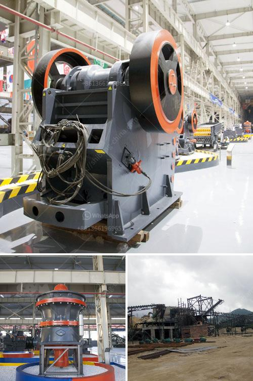

<h3>crusher application</h3>
Crushers are used in various industries to reduce the size of large rocks or gravels into smaller pieces. They play an essential role in construction, mining, waste management, and recycling, among other applications. With advancements in technology, crushers have become more efficient, offering benefits such as increased productivity, reduced energy consumption, and improved safety.

In the construction industry, crushers are widely used to break down materials like concrete, bricks, and stones. They are instrumental in producing aggregates used in road construction, building foundations, and making concrete for various structures. Crushers with strong capabilities can process large quantities of materials quickly, saving time and labor costs.

Mining companies heavily rely on crushers to extract valuable minerals and ores from the earth. These machines can crush hard rock formations, which contain precious metals such as gold and silver, allowing them to be extracted for further processing. Crushers in mining operations are designed to withstand harsh conditions and deliver steady production rates to maximize profitability.

Waste management and recycling industries also benefit greatly from crusher applications. Organic waste, plastics, and other recyclable materials can be turned into smaller pieces, making it easier to transport and separate for recycling purposes. By reducing the size of waste, crushers help to optimize waste management practices, reduce landfill usage, and promote a more sustainable environment.

Additionally, crushers contribute to workplace safety by minimizing the risk of injury caused by manually breaking down large materials. This is particularly significant in the construction and mining industries, where workers are exposed to physically demanding tasks. By automating the process, crushers offer a safer and more efficient alternative.

In conclusion, crushers have proven to be invaluable tools in various applications across industries. Their ability to reduce material size and increase efficiency has made them an integral part of construction, mining, waste management, and recycling operations. As technology continues to advance, crushers will further enhance productivity, reduce energy consumption, and improve safety standards in the years to come.
<h3>Contact us</h3><ul><li><strong>Whatsapp:&nbsp;<a href="https://wa.me/8613661969651">+8613661969651</a></strong></li><li><a href="https://swt.shibang-china.com/?git&amp;zhl&amp;crusher application"><strong>Online Service(chat now)</strong></a></li></ul><h3>Related</h3><ul><li><a href='economic analysis of conveyor system.md'>economic analysis of conveyor system</a></li><li><a href='used hammer mill crushers.md'>used hammer mill crushers</a></li><li><a href='kaolin portable crusher provider in nigeria.md'>kaolin portable crusher provider in nigeria</a></li><li><a href='calcium carbonate machine supplier in turkey.md'>calcium carbonate machine supplier in turkey</a></li><li><a href='crusher machine supplier malaysia.md'>crusher machine supplier malaysia</a></li></ul>