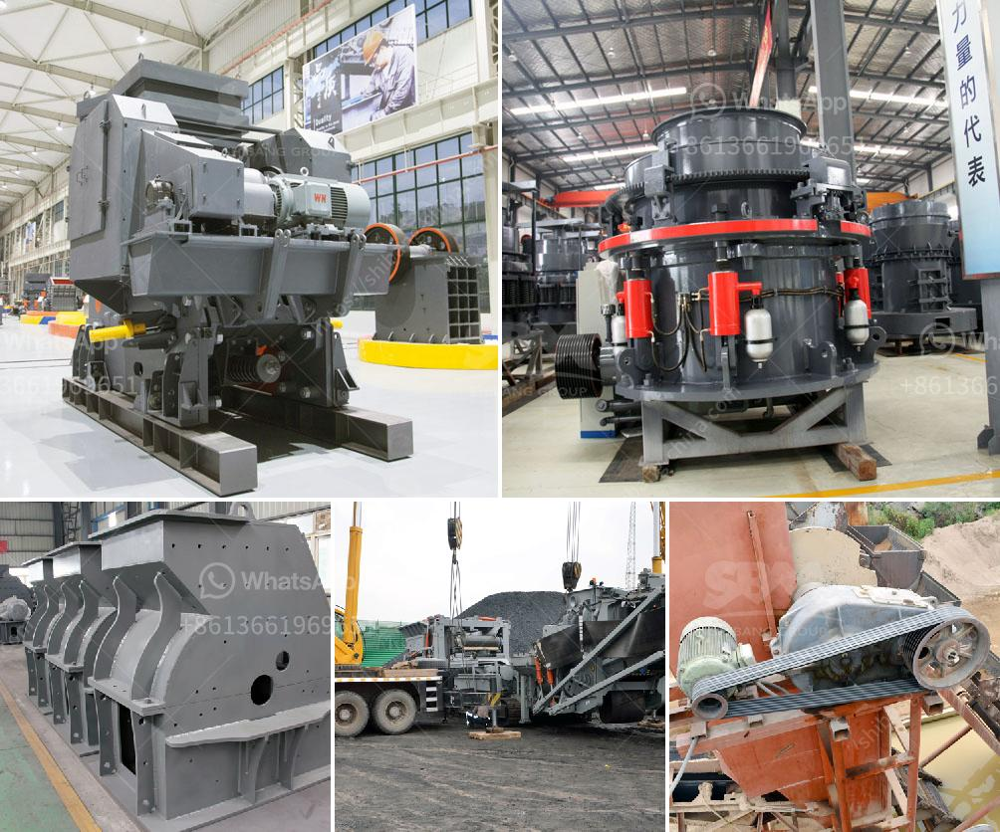

<h3>crusher equipment for sale</h3>
Crushers are an essential part of the mining and quarrying industry. They help break down large rocks into smaller, more manageable pieces for further processing. Various types of crushers are available in the market, each with different capabilities and suitable applications. In this article, we will explore the crusher equipment for sale, types available, and the benefits they offer.

Crusher equipment is used to reduce the size of materials such as rocks, stone, coal, slag, and ores. Depending on the application, crushers can be either stationary or portable. Manual or mechanical methods can be used to extract materials from the earth.

The demand for crushers is constantly increasing due to their extensive applications in the construction, mining, and recycling industries. They are used to process a wide range of materials, such as limestone, granite, gypsum, concrete, and more. Crushers come in various sizes and capacities to suit different project requirements.

   - Ideal for primary crushing, jaw crushers provide excellent performance in terms of capacity and reduction ratio.

   - Jaw crushers are commonly used in aggregate production, mining operations, and recycling applications.

   - Designed for secondary crushing, impact crushers are versatile machines that can handle a wide range of materials.

   - Impact crushers are suitable for both soft and hard rocks and are often used in aggregate, mining, and recycling industries.

   - They are used in the secondary and tertiary crushing stages to crush materials down to finer sizes.

   - Well-suited for handling abrasive materials, hammer crushers are designed for high capacity and continuous operation.

   - Crushers can process large amounts of material quickly, reducing the time and effort required for manual extraction.

   - With the right crusher, you can achieve high production rates and improve your overall productivity.

   - Crushers come in various types, sizes, and capacities, allowing you to choose the most suitable one for your specific needs.

In conclusion, crusher equipment for sale plays a crucial role in various industries. By choosing the right type of crusher, you can increase efficiency, reduce costs, and achieve maximum output. Whether you require primary, secondary, or tertiary crushing, there are crushers available to meet your specific requirements. Invest in crusher equipment for sale and enhance the efficiency of your operations.
<h3>Contact us</h3><ul><li><strong>Whatsapp:&nbsp;<a href="https://wa.me/8613661969651">+8613661969651</a></strong></li><li><a href="https://swt.shibang-china.com/?git&amp;zhl&amp;crusher equipment for sale"><strong>Online Service(chat now)</strong></a></li></ul><h3>Related</h3><ul><li><a href='ballast crusher cost.md'>ballast crusher cost</a></li><li><a href='calcium carbonate production plant.md'>calcium carbonate production plant</a></li><li><a href='domestic mobile crusher.md'>domestic mobile crusher</a></li><li><a href='mobile crushing and screening.md'>mobile crushing and screening</a></li><li><a href='study of a fero chrome crushing plant.md'>study of a fero chrome crushing plant</a></li></ul>