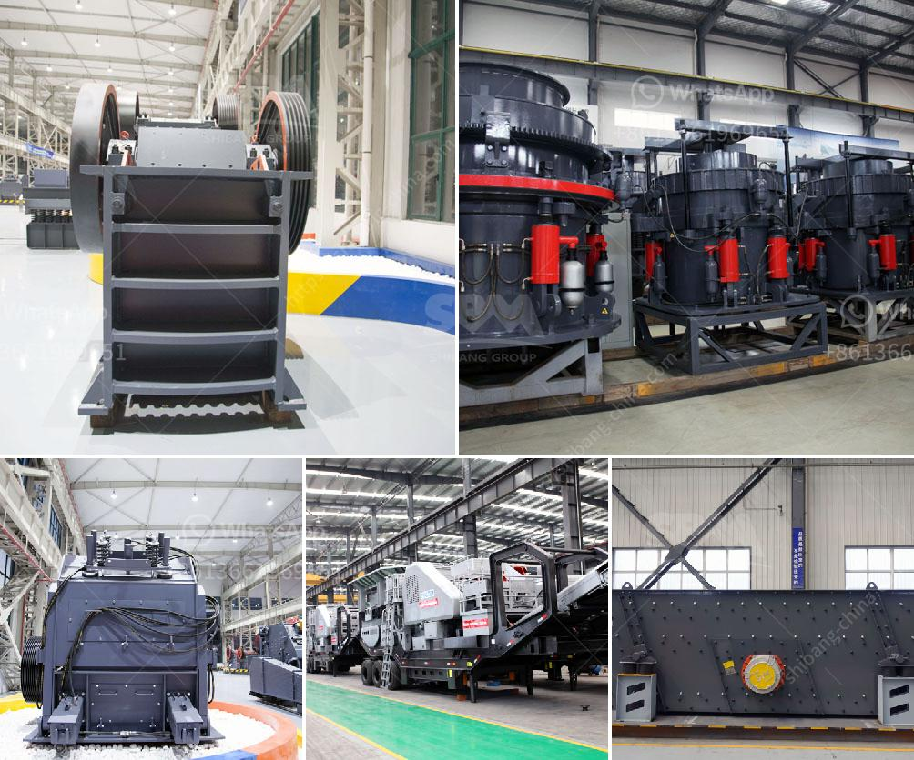

<h3>crusher for pozzolana</h3>
In the world of construction, finding ways to optimize cutting-edge technologies and materials is crucial. One such remarkable innovation is the crusher for pozzolana, a cutting-edge machine that has revolutionized construction processes. With its ability to efficiently crush and mix pozzolanic materials, this crusher is transforming the construction industry by offering numerous benefits and opening doors for sustainable development.

Pozzolana refers to a fine, sandy volcanic ash of high silica content that is commonly found near volcanic regions. It has been used for construction purposes for centuries due to its incredible binding properties. When mixed with lime, pozzolana forms a strong cementitious material that is highly resistant to chemical attacks. This makes pozzolana an essential component in the production of cement and concrete.

The crusher for pozzolana plays a pivotal role in the production process by efficiently crushing pozzolanic rocks into smaller particles. This process enhances the reactivity of these materials, making them more effective in cement and concrete production. By ensuring an even particle size, the crusher significantly improves the quality and strength of the final product.

By effectively grinding pozzolanic materials, the crusher enhances the chemical reaction between these materials and lime. This results in a stronger, more durable cementitious product with improved binding properties. Consequently, the overall quality and performance of the construction materials are greatly enhanced.

The crusher for pozzolana enables the utilization of natural materials, reducing the need for resource-intensive processes. By utilizing volcanic ash as a primary ingredient, the crusher promotes sustainable practices and reduces waste. Additionally, the increased reactivity of the crushed materials means that fewer additives, such as Portland cement, are required. This further reduces the carbon footprint associated with construction projects.

The crusher for pozzolana offers significant cost savings to construction companies. By efficiently crushing raw materials, it minimizes the need for excessive energy consumption, reducing operational costs. Furthermore, the crusher's ability to enhance the reactivity of materials reduces the required quantity of expensive additives, resulting in substantial financial savings.

The crusher for pozzolana is highly flexible and can be easily adjusted to meet various construction needs. It can crush different types of pozzolanic rocks, ensuring compatibility with a wide range of projects. Moreover, the crusher is equipped with advanced technologies that allow for precise control over the particle size, resulting in tailored solutions for specific construction requirements.

The crusher for pozzolana is an exceptional innovation that has transformed construction processes worldwide. With its ability to efficiently crush and mix pozzolanic materials, it offers several benefits such as increased cementitious properties, reduced environmental impact, cost-effectiveness, and versatility. By harnessing this technology, construction companies are not only improving the quality of their products but also contributing to sustainable development practices. As the world continues to prioritize green and sustainable construction, this incredible crusher is undoubtedly playing a vital role in shaping the future of the industry.
<h3>Contact us</h3><ul><li><strong>Whatsapp:&nbsp;<a href="https://wa.me/8613661969651">+8613661969651</a></strong></li><li><a href="https://swt.shibang-china.com/?git&amp;zhl&amp;crusher for pozzolana"><strong>Online Service(chat now)</strong></a></li></ul><h3>Related</h3><ul><li><a href='grinding mills in usa.md'>grinding mills in usa</a></li><li><a href='grinding machine for making fine powder.md'>grinding machine for making fine powder</a></li><li><a href='how to make stone crusher plant.md'>how to make stone crusher plant</a></li><li><a href='150 ton per hour gold wash plant.md'>150 ton per hour gold wash plant</a></li><li><a href='equipment for gold mine tailings in ghana.md'>equipment for gold mine tailings in ghana</a></li></ul>