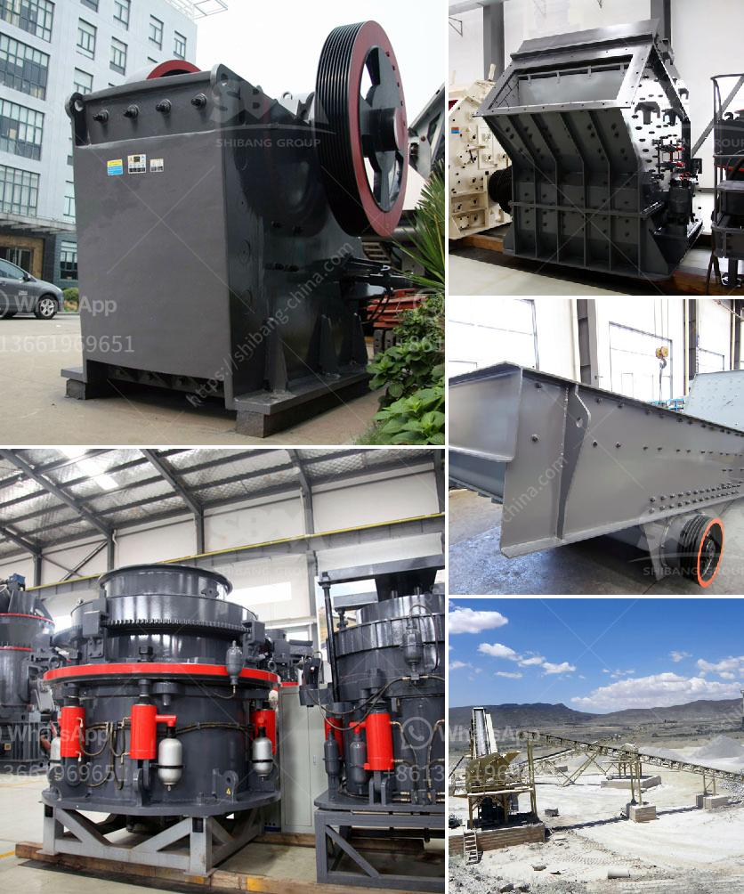

<h3>crusher for sale in kenya</h3>
Kenya is a country of diverse resources that can be tapped on to thrive economically. An increasing number of individuals and companies are exploring lucrative business opportunities in Kenya by venturing into the construction industry. One fundamental tool that is essential in the construction industry is a crusher. With a crusher, stones are crushed, reducing them to manageable sizes for further use. If you are considering purchasing a crusher for sale in Kenya, here are four crucial factors to consider.

Firstly, it is important to evaluate the type of crusher that will suit your needs. Crushers come in different sizes, designs, and functionalities. Assess your project requirements and determine whether a jaw crusher, impact crusher, or cone crusher is suitable. Additionally, consider the capacity and power consumption of the crusher to ensure it can handle the workload effectively.

Secondly, examine the quality and durability of the crusher. Investing in a high-quality crusher guarantees longevity and minimal maintenance costs. Inspect the materials used in the construction of the crusher and inquire about the warranty provided by the manufacturer. A thorough examination of the crusher's components, such as the frame, bearings, and discharge opening, will help you make an informed decision.

Thirdly, factor in the price of the crusher. While it may be tempting to opt for the cheapest option, it is crucial to strike a balance between affordability and quality. Compare prices from different suppliers and consider the overall value for money. A slightly higher initial cost may save you from expensive repairs or replacements in the long run.

Lastly, assess the availability of spare parts and after-sales service. A crusher is a complex machine composed of numerous parts that may require occasional replacements. Ensure that the supplier provides readily available spare parts to minimize downtime. Additionally, inquire about the after-sales service offered, including technical support and maintenance.

In conclusion, purchasing a crusher in Kenya involves careful consideration of several factors. By evaluating the type, quality, price, and availability of spare parts, you can make an informed decision that aligns with your project requirements and budget. Remember, a well-chosen crusher will ultimately contribute to the success of your construction projects in Kenya.
<h3>Contact us</h3><ul><li><strong>Whatsapp:&nbsp;<a href="https://wa.me/8613661969651">+8613661969651</a></strong></li><li><a href="https://swt.shibang-china.com/?git&amp;zhl&amp;crusher for sale in kenya"><strong>Online Service(chat now)</strong></a></li></ul><h3>Related</h3><ul><li><a href='coal crusher machine.md'>coal crusher machine</a></li><li><a href='sand crusher machine hyderabad for sale.md'>sand crusher machine hyderabad for sale</a></li><li><a href='stone crusher germany.md'>stone crusher germany</a></li><li><a href='sample of joint operations agreement quarry mining.md'>sample of joint operations agreement quarry mining</a></li><li><a href='vibrating screen consumption.md'>vibrating screen consumption</a></li></ul>