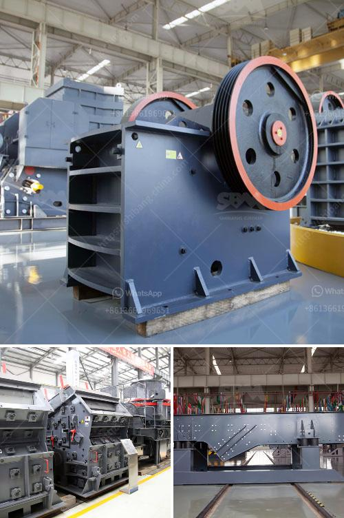

<h3>crusher for sale kenya</h3>
Kenya is a country that is endowed with numerous natural resources. These resources include limestone, gypsum, phosphate, marble, granite, and many others. The growth of the construction industry in Kenya has created a high demand for crushers, both locally and internationally. Crushers are machines used to break large rocks and stones into smaller particles, making them suitable for construction purposes.

When it comes to purchasing a crusher in Kenya, various factors need to be considered, such as cost, quality, and efficiency. Fortunately, there are reputable sellers in Kenya that provide crushers for sale to cater to these needs.

Quality is a primary concern when purchasing a crusher. A high-quality crusher ensures durability and efficient crushing. Most sellers in Kenya offer crushers that are made from sturdy materials, such as steel, ensuring their longevity. Additionally, these crushers are equipped with advanced features, allowing for efficient crushing and minimizing downtime.

Cost-effectiveness is another crucial factor to consider when purchasing a crusher in Kenya. The sellers understand the needs of their customers and offer crushers at competitive prices. Furthermore, the cost efficiency of these crushers is enhanced by their energy-saving capabilities, reducing operational costs in the long run.

Sellers in Kenya not only provide quality crushers at affordable prices, but they also offer after-sales services. This includes professional installation, maintenance, and repair services. They also provide spare parts for the crusher, ensuring its smooth operation in case of future repairs and replacements needed.

In conclusion, crushers for sale in Kenya offer a blend of quality, value, and cost-effectiveness. They are manufactured using durable materials, ensuring their longevity and efficient crushing. The competitive prices make them a preferable choice for both local and international customers. With after-sales services and spare parts availability, these crushers offer a complete solution for construction needs in Kenya. So, if you are in need of a crusher for your construction project, it is wise to explore the options available in the Kenyan market.
<h3>Contact us</h3><ul><li><strong>Whatsapp:&nbsp;<a href="https://wa.me/8613661969651">+8613661969651</a></strong></li><li><a href="https://swt.shibang-china.com/?git&amp;zhl&amp;crusher for sale kenya"><strong>Online Service(chat now)</strong></a></li></ul><h3>Related</h3><ul><li><a href='gypsum board crusher machine.md'>gypsum board crusher machine</a></li><li><a href='complete stone crusher plant manufacturer from italy.md'>complete stone crusher plant manufacturer from italy</a></li><li><a href='industrial crusher machine.md'>industrial crusher machine</a></li><li><a href='hammers mill machine.md'>hammers mill machine</a></li><li><a href='vibrating sieve supplier in south africa.md'>vibrating sieve supplier in south africa</a></li></ul>