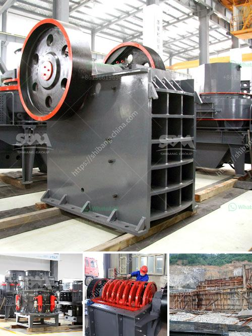

<h3>crusher for stone stone</h3>
The stone crusher, also known as a stone breaker, is a powerful and highly efficient machine used in the mining and construction industry to process and crush stones. It employs two sets of jaws, namely, the stationary and movable jaws, to do the task. Powered by an electric motor, the crusher is capable of exerting a high level of force on large rocks, breaking them down into smaller pieces that are suitable for construction purposes.

The crusher for stone works by applying a compressive force to the material, which is then crushed and released. The newfound crushed stones can be used for various applications, such as building roads, foundations, and even concrete production. With its ability to handle different types of stones, the crusher is an essential tool in the construction industry.

In addition to its efficiency, the stone crusher also offers versatility. Its adjustable jaws allow for different sizes of stones to be crushed, giving contractors the flexibility to meet the specific requirements of their projects. Furthermore, the machine is designed to withstand heavy-duty use, making it durable and reliable, even under challenging conditions.

Safety is also a priority when using the crusher for stone. Various safety features are incorporated into the design, such as protective guards and an emergency shut-off switch to prevent accidents and injuries.

Investing in a stone crusher can significantly improve construction projects by reducing costs and increasing productivity. By crushing and recycling stones on-site, contractors can save on transportation expenses and eliminate the need to purchase new aggregate materials. This not only helps to reduce the carbon footprint but also contributes to sustainable construction practices.

Overall, the crusher for stone is an indispensable machine in the construction industry. Its ability to crush stones efficiently and effectively makes it a valuable tool for contractors and project managers alike. With the various features and benefits it offers, investing in a stone crusher is a smart choice for any construction project.
<h3>Contact us</h3><ul><li><strong>Whatsapp:&nbsp;<a href="https://wa.me/8613661969651">+8613661969651</a></strong></li><li><a href="https://swt.shibang-china.com/?git&amp;zhl&amp;crusher for stone stone"><strong>Online Service(chat now)</strong></a></li></ul><h3>Related</h3><ul><li><a href='aggregate washing machine.md'>aggregate washing machine</a></li><li><a href='silica powder grinding machine.md'>silica powder grinding machine</a></li><li><a href='crusher machine discount.md'>crusher machine discount</a></li><li><a href='crossley economy x ball mill.md'>crossley economy x ball mill</a></li><li><a href='small stone crusher for sale.md'>small stone crusher for sale</a></li></ul>