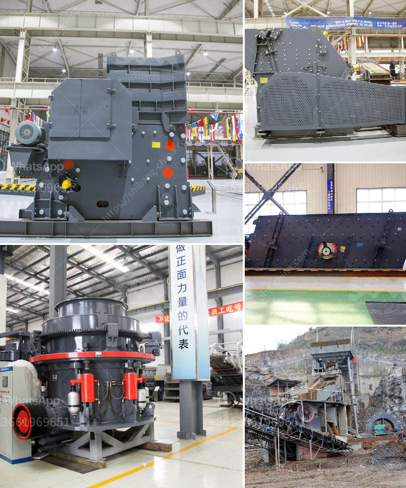

<h3>crusher machine bottlecrusher machine bottles</h3>
Crusher machines have become an integral part of our society in recent years. With the pressing need to reduce waste and protect the environment, more and more people worldwide have started using bottle crusher machines. These machines are specifically designed to crush used plastic bottles into smaller pieces or even fine powder, making them ideal for recycling.

The bottle crusher machine works by using high pressure to compress the plastic bottles, reducing their size and volume. The crushed bottles can then be melted down and transformed into new products, such as plastic pellets or fiber. This not only helps in conserving raw materials but also reduces energy consumption and greenhouse gas emissions.

One of the key benefits of using bottle crusher machines is the reduction in waste. As plastic waste is a growing concern globally, it's crucial to find innovative ways to manage and dispose of plastic bottles properly. By crushing the bottles, we can significantly minimize the amount of plastic waste that ends up in landfills or oceans, causing harm to the environment and wildlife.

Furthermore, bottle crusher machines are easy to operate and require minimal effort. They can be installed in various locations, such as supermarkets, shopping malls, or even at household recycling centers. This accessibility encourages people to adopt sustainable practices and contribute to a greener future.

In addition to waste reduction, using bottle crusher machines also has financial benefits. Many recycling centers and waste management facilities offer incentives for individuals or businesses who bring in crushed plastic bottles. These incentives can range from cash rewards to discounts or vouchers for various products or services. Not only does this create a financial incentive for individuals, but it also encourages businesses to invest in bottle crusher machines, helping them recover the initial investment.

To conclude, crusher machines for plastic bottles are an excellent solution to address the growing concerns of plastic waste. They offer a convenient and effective way to reduce waste, conserve resources, and protect the environment. By embracing the use of bottle crusher machines, individuals and businesses can make a significant contribution towards creating a sustainable and eco-friendly world.
<h3>Contact us</h3><ul><li><strong>Whatsapp:&nbsp;<a href="https://wa.me/8613661969651">+8613661969651</a></strong></li><li><a href="https://swt.shibang-china.com/?git&amp;zhl&amp;crusher machine bottlecrusher machine bottles"><strong>Online Service(chat now)</strong></a></li></ul><h3>Related</h3><ul><li><a href='limestone powder making plant ireland.md'>limestone powder making plant ireland</a></li><li><a href='m sand crusher in district.md'>m sand crusher in district</a></li><li><a href='design of screening machines.md'>design of screening machines</a></li><li><a href='powder making machine south africa.md'>powder making machine south africa</a></li><li><a href='difference between chain and belt conveyors.md'>difference between chain and belt conveyors</a></li></ul>