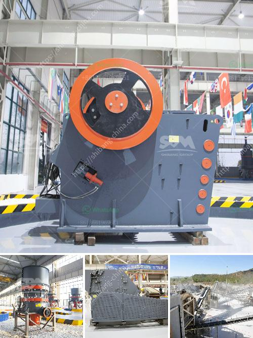

<h3>crusher machine discount</h3>
Title: Unmissable Crusher Machine Discounts: Utilize this Opportunity to Enhance Efficiency and Savings

In the world of industrial manufacturing, the importance of efficient machinery cannot be overstated. Among the critical machines used in various industries, crushers play a vital role in reducing the size of different materials. These crushers range from jaw crushers to impact crushers, making them indispensable for businesses seeking faster and cost-effective material processing. Now, with an unprecedented crusher machine discount offer, industries have a golden opportunity to enhance their operations while saving significantly on investments.

The crusher machine market is buzzing with excitement as leading manufacturers and suppliers roll out jaw-dropping discount offers. With an extensive range of crusher machines available, customers can now enjoy substantial price reductions, ensuring that efficiency is matched with value for money.

By investing in advanced crusher machines, industries can experience a significant improvement in their operational efficiency. These machines are designed to handle extensive workloads, translating into higher productivity rates and reduced processing time. The discount available on these machines makes it a strategic move to upgrade equipment, ultimately leading to more streamlined operations.

The crusher machine discount being offered is a boon for businesses seeking to optimize their budget. By securing high-quality crushers at reduced prices, enterprises can divert their savings towards other aspects of their operations such as maintenance, workforce training, or expanding their product range.

While the discount offer may raise some skepticism about the quality of the machines, rest assured that reputable manufacturers back these discount offers. They are committed to maintaining their reputation and ensuring the reliability of their products. Customers can still expect top-quality machinery that meets industry standards at affordable rates.

The discount offer extends to a wide range of crusher machines, ensuring there is something available for every industry's distinct needs. From small-scale industries to large-scale manufacturing plants, these jaw crushers, impact crushers, and related equipment are sure to meet specific requirements efficiently.

The current discount offer on crusher machines presents a rare opportunity for industries to upgrade their material processing capabilities while saving money. By seizing this chance to invest in advanced machinery, businesses can increase their efficiency, reduce costs, and outperform their competitors. Don't let this discount pass you by - now is the time to take your operations to the next level with state-of-the-art crusher machines.
<h3>Contact us</h3><ul><li><strong>Whatsapp:&nbsp;<a href="https://wa.me/8613661969651">+8613661969651</a></strong></li><li><a href="https://swt.shibang-china.com/?git&amp;zhl&amp;crusher machine discount"><strong>Online Service(chat now)</strong></a></li></ul><h3>Related</h3><ul><li><a href='second hand stone crusher equipment medium size.md'>second hand stone crusher equipment medium size</a></li><li><a href='iron processing plant cost.md'>iron processing plant cost</a></li><li><a href='mobile crushers ghana.md'>mobile crushers ghana</a></li><li><a href='crusher for stone stone.md'>crusher for stone stone</a></li><li><a href='production line for calcium carbonate.md'>production line for calcium carbonate</a></li></ul>