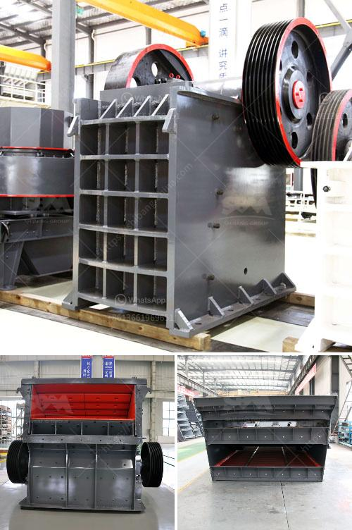

<h3>crusher machine for feldspar</h3>
Feldspar is the most common ore in the earth crust and it even appears on the moon and in the aerolite. In some parts of the earth crust, 15km under the earth's surface, feldspar accounts for 60%. Feldspar is the main component of igneous and is also common in metamorphic rock and sedimentary rock. Feldspar is one silicate minerals which contains calcium, sodium and potassium. Feldspar has abundant reserves and is widely distributed.

Feldspar crusher is an important feldspar crushing machine in feldspar crushing plant. Feldspar crusher mainly includes jaw cursher, impact crusher, cone crusher and so on. Jaw crusher for crushing feldspar is the most widely used stone crusher. Feldspar jaw crusher features simple structure, easy maintenance, stable performance, high efficiency and low operation cost, etc. Jaw crusher usually is used as the primary crusher in feldspar crushing plant.

Impact crusher for crushing feldspar includes traditional impact crusher and hydraulic feldspar impact crusher. Feldspar cone crusher includes symons cone crusher, spring cone crusher, hydraulic cone crusher and so on. During feldspar crushing plant, DSMAC can also supply vibrating feeder, vibrating screen, belt conveyor and feldspar washing machine. Feldspar crusher is your best choice in feldspar curshing plant and feldspar mining industry.

According to the different ores and requirements of output, we design the different feldspar crushing plants with different crusher machines to meet the Feldspar applications. With the famous brand of construction and minining equipments, we provide a complete series of feldspar crushing plant for sale to the world, such as jaw crusher, impact crusher, cone crusher, mobile crusher etc. Our feldspar crushing machine and feldspar grinding equipments have excellent performance, and have exported to many countries, such as USA, India, Australia, Ghana, Russia, Canada, Egypt, UZ, Nubia, Peru, Indonesia, Brazil, Papua New Guinea, Ghana, Mexico, Philippines, Zimbabwe, Mali, Kyrghyzstan, Argentina, Guinea, KZ, etc.

The feldspar crushing process is a multilevel process and it can be divided into primary crushing, secondary crushing and fine crushing. Primary crushing and screening take place at the mine site. Primary crushing is accomplished by using jaw crushers and impact crushers. Oversize material is passed through additional crushers and classifiers to achieve the desired particle size. The ore is then crushed and sized at a secondary crushing facility. Secondary crushing, if necessary and economic, is accomplished by using standard cone crushers followed by short head cone crushers. Feldspar grinding machine is widely used in modern industrial processing, grinding Feldspar is the most common ore in the earth crust and it even appears on the moon and in the aerolite. In some parts of the earth crust, 15km under the earth's surface, feldspar accounts for 60%. Feldspar is the main component of igneous and is also common in metamorphic rock and sedimentary rock. Feldspar is one silicate minerals which contains calcium, sodium and potassium. Feldspar has abundant reserves and is widely distributed.

In conclusion, the crusher machine for feldspar is the efficient and energy-saving equipment which can meet different demands of customers. It is an indispensable device in feldspar mining and processing. The selection of a crusher with high efficiency and low energy consumption can significantly increase the economic benefits of feldspar enterprises.
<h3>Contact us</h3><ul><li><strong>Whatsapp:&nbsp;<a href="https://wa.me/8613661969651">+8613661969651</a></strong></li><li><a href="https://swt.shibang-china.com/?git&amp;zhl&amp;crusher machine for feldspar"><strong>Online Service(chat now)</strong></a></li></ul><h3>Related</h3><ul><li><a href='calcium carbonate grinding mill.md'>calcium carbonate grinding mill</a></li><li><a href='equipment jaw crusher for sale philippine.md'>equipment jaw crusher for sale philippine</a></li><li><a href='i need for a stone crushing plant.md'>i need for a stone crushing plant</a></li><li><a href='uk calcium carbonate grinding.md'>uk calcium carbonate grinding</a></li><li><a href='cost of 200tph stage bmw crushing plant.md'>cost of 200tph stage bmw crushing plant</a></li></ul>