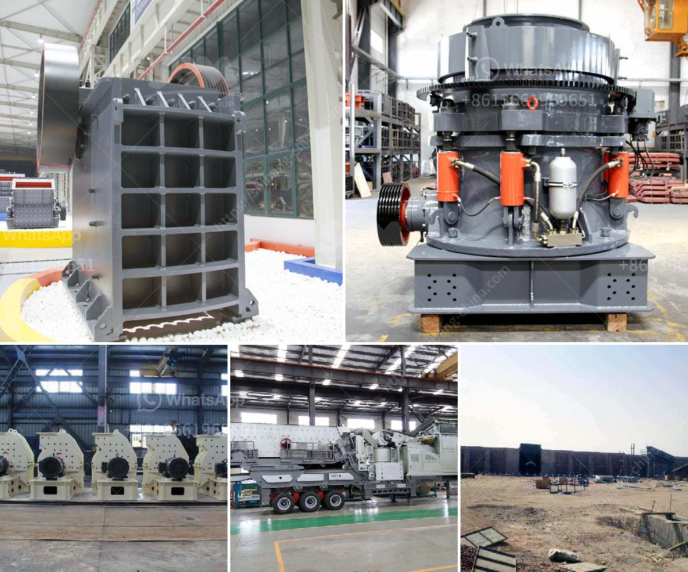

<h3>crusher machine for mineral powder</h3>
A crusher machine is a powerful machine used to reduce the size of different types of materials. These machines use force and pressure to crush the material into smaller pieces. Crusher machines are calibrating devices that enable the user to get a certain size of mineral powder. Crushers are designed to break up hard rock or gravel into smaller pieces. They are often used for aggregate production purposes but can also be utilized in mining and industrial applications.

When it comes to mineral powder, a crusher machine plays an essential role in grinding the mineral into fine particles. These machines are equipped with sharp, sturdy blades that can rotate at high speeds to crush the material. They are capable of handling various types of minerals, such as limestone, barite, talc, gypsum, and more.

One of the significant advantages of using a crusher machine for mineral powder is its efficiency. It can process large quantities of materials quickly, saving time and effort. Additionally, crusher machines are designed with safety features to ensure the protection of both the operator and the machine itself.

Another important feature is the versatility of crusher machines. They can be adjusted to produce mineral powder in different sizes according to the specific requirements of the user. This adaptability makes it suitable for various applications, from construction to industrial manufacturing.

Furthermore, crusher machines for mineral powder are often equipped with advanced technology and automation systems. These advancements allow for precise control over the grinding process, ensuring consistent quality and efficiency. The operator can monitor and adjust the speed, pressure, and other parameters to achieve the desired particle size.

In conclusion, a crusher machine for mineral powder is a valuable tool in many industries. Its ability to quickly and efficiently grind various materials into fine particles makes it an essential asset in aggregate production, mining, and industrial applications. With advanced technology and safety features, these machines provide reliable and consistent performance, meeting the specific requirements of users.
<h3>Contact us</h3><ul><li><strong>Whatsapp:&nbsp;<a href="https://wa.me/8613661969651">+8613661969651</a></strong></li><li><a href="https://swt.shibang-china.com/?git&amp;zhl&amp;crusher machine for mineral powder"><strong>Online Service(chat now)</strong></a></li></ul><h3>Related</h3><ul><li><a href='list of used machines coal mining.md'>list of used machines coal mining</a></li><li><a href='jaw crusher machine supplier.md'>jaw crusher machine supplier</a></li><li><a href='grinding mills in usa.md'>grinding mills in usa</a></li><li><a href='gold shaker wash plant trommel for sale used new.md'>gold shaker wash plant trommel for sale used new</a></li><li><a href='copper processing stages.md'>copper processing stages</a></li></ul>