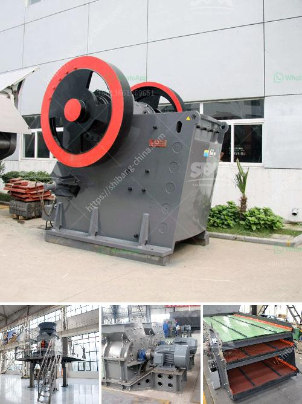

<h3>crusher machine for sale kenya</h3>
When it comes to building and construction in Kenya, one of the key requirements is high-quality materials. This is where crusher machines come into play. These powerful machines are designed to crush stones and rocks into smaller pieces for easier transportation and further processing.

Crusher machines come in different types, sizes, and capacities to meet the diverse needs of construction projects in Kenya. From primary crushers for larger stones to secondary and tertiary crushers for finer materials, there are machines to cater to all stages of stone crushing.

The crusher market in Kenya is growing rapidly due to increasing demand from the construction industry and the need for high-quality materials. In addition, government initiatives aimed at promoting infrastructure development are also contributing to the growth of this industry.

There are several key factors to consider when purchasing a crusher machine in Kenya. Firstly, it is important to assess the intended use and capacity requirements. Depending on the nature of the project, the capacity of the machine may vary. It is crucial to choose a machine that can handle the expected workload efficiently.

Another important consideration is the reliability and durability of the machine. Construction projects can be demanding, often requiring prolonged and continuous operation. Therefore, opting for a machine with a robust design and high-quality components will ensure long-term performance and minimal downtime.

Additionally, one should also consider the availability of spare parts and after-sales support. A reliable supplier that can provide timely maintenance, repairs, and spare parts is essential to keep the machine running smoothly and minimize any disruptions to the construction project.

Fortunately, there are several suppliers and manufacturers in Kenya offering crusher machines for sale. By thoroughly researching and comparing different options, builders and contractors can find the best crusher machine suited to their specific needs and budget.

In conclusion, crusher machines are essential for the construction industry in Kenya. They help in the efficient processing of stones and rocks, ensuring high-quality materials for building projects. It is crucial to choose a reliable and durable machine that can handle the workload and comes with excellent after-sales support. With the right crusher machine, builders can confidently undertake their projects, knowing they have the necessary equipment to meet their needs.
<h3>Contact us</h3><ul><li><strong>Whatsapp:&nbsp;<a href="https://wa.me/8613661969651">+8613661969651</a></strong></li><li><a href="https://swt.shibang-china.com/?git&amp;zhl&amp;crusher machine for sale kenya"><strong>Online Service(chat now)</strong></a></li></ul><h3>Related</h3><ul><li><a href='malaysia tin ore cursher supplier.md'>malaysia tin ore cursher supplier</a></li><li><a href='stone crusher manufacturer dhaka.md'>stone crusher manufacturer dhaka</a></li><li><a href='gyratory cone crusher manufacturers china.md'>gyratory cone crusher manufacturers china</a></li><li><a href='price of ceramic making machine in india.md'>price of ceramic making machine in india</a></li><li><a href='used portable impact crusher for sale in uae.md'>used portable impact crusher for sale in uae</a></li></ul>