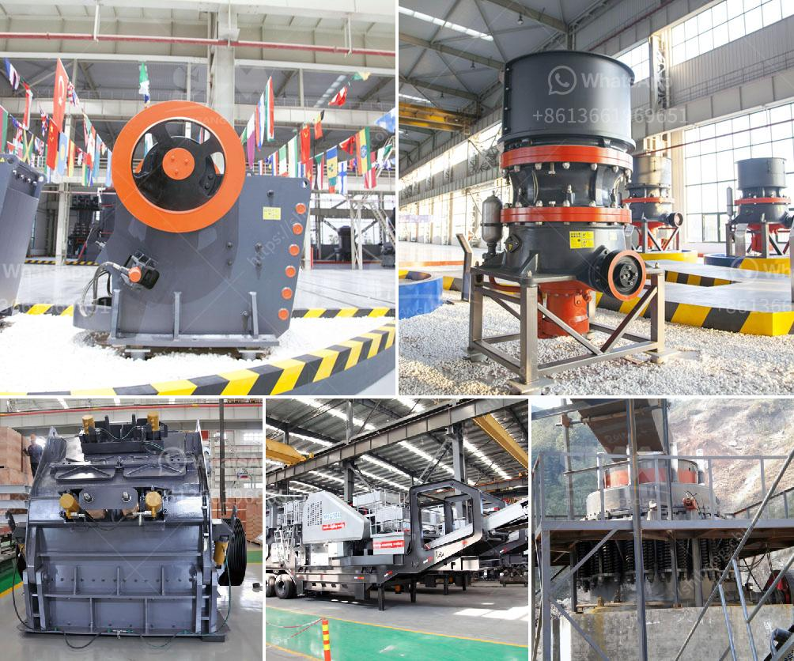

<h3>crusher machine kenya</h3>
Crusher machines are used to make the process of recycling more convenient, safe, and eco-friendly. These powerful machines efficiently reduce the size of large materials to make them easily manageable for recycling or disposal purposes. In Kenya, crusher machines are vital equipment for breaking down stones, concrete, or other materials into smaller pieces for further processing, making them more accessible and usable.

One of the primary industries that rely on crusher machines is the mining industry. The mining sector in Kenya is dominated by precious metals and non-metallic minerals such as gypsum, limestone, soda ash, diatomite, gemstones, and fluorspar. Crushing these minerals into smaller pieces is essential for efficient extraction and subsequent processing.

In recent years, Kenya has experienced a boom in the construction industry, leading to an increased demand for construction materials. Crusher machines play a crucial role in this sector by breaking down large stones into smaller sizes suitable for construction works. These machines make it more convenient for construction companies to access and utilize the required materials for various projects.

Another significant industry in Kenya that utilizes crusher machines is the recycling industry. With the growing concerns about environmental sustainability, recycling has become a critical practice globally. Crusher machines are used to crush and reduce the size of various recyclable materials such as plastic bottles, paper, metals, glass, and tires. By breaking down these materials, crusher machines make it easier to handle and transport recyclables while also maximizing the recycling process's efficiency.

Crusher machines in Kenya come in various types, including jaw crushers, cone crushers, impact crushers, and even mobile crushers. The versatility of these machines enables them to be used in different industries. Each machine is designed to tackle specific material types and sizes efficiently. For instance, jaw crushers are primarily used for crushing large stones, while cone crushers are more suitable for secondary or tertiary crushing.

One of the leading providers of crusher machines in Kenya is SBM. SBM is a prominent manufacturer of high-quality crusher machines that provide advanced features, durability, and a long lifespan. Their machines are equipped with the latest technology to handle even the toughest materials efficiently. With an aim to support sustainable development, SBM ensures that their crusher machines are energy-efficient and environmentally friendly.

In conclusion, crusher machines in Kenya play a crucial role in various industries, including mining, construction, and recycling. These machines help break down large materials into smaller, manageable sizes, making them accessible for further processing. Crusher machines also contribute to environmental sustainability by improving the efficiency of recycling processes. With the growing demand for construction materials and the need for sustainable practices, the utilization of crusher machines is expected to continue to increase in Kenya.
<h3>Contact us</h3><ul><li><strong>Whatsapp:&nbsp;<a href="https://wa.me/8613661969651">+8613661969651</a></strong></li><li><a href="https://swt.shibang-china.com/?git&amp;zhl&amp;crusher machine kenya"><strong>Online Service(chat now)</strong></a></li></ul><h3>Related</h3><ul><li><a href='cost a stone crusher.md'>cost a stone crusher</a></li><li><a href='block making machine in canada.md'>block making machine in canada</a></li><li><a href='sand making stone quarry.md'>sand making stone quarry</a></li><li><a href='second hand jaw crusher for sale in harare.md'>second hand jaw crusher for sale in harare</a></li><li><a href='silicon wafer crusher.md'>silicon wafer crusher</a></li></ul>