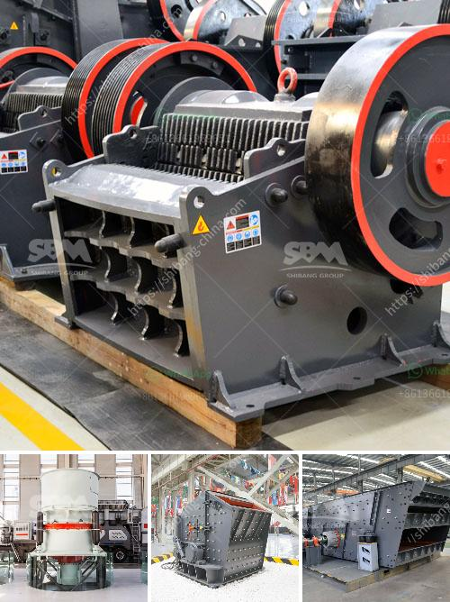

<h3>crusher machine supplier malaysia</h3>
Malaysia ranks among the world's top producers of palm oil, rubber, timber, and cocoa beans. As such, the country focuses on becoming an industrialized nation, prompting the need for advanced machinery, including crusher machines. A crusher machine supplier in Malaysia is a specialized supplier of equipment and machines for the mining and construction industry.

With its robust and powerful capabilities, crusher machines can process a wide range of materials, including stone, rocks, marble, and granite. Therefore, crusher machines are essential equipment in road construction and infrastructure development projects, ensuring quality materials are efficiently and effectively processed.

When it comes to choosing a crusher machine supplier in Malaysia, it is crucial to look for a reputable and reliable supplier. Here are some key factors to consider when selecting a crusher machine supplier in Malaysia:

1. Experience and expertise: Ensure the supplier has extensive experience and expertise in the industry. A reputable supplier will have a proven track record of delivering high-quality crusher machines to various customers.

2. Quality and durability: Quality and durability are vital aspects to consider when selecting a crusher machine supplier. Look for a supplier that offers high-quality machines with durable components that can withstand the demanding conditions of the mining and construction industry.

3. Product range: The supplier should offer a wide range of crusher machines and equipment to cater to different requirements and applications. They should have various types of crushers, such as jaw crushers, impact crushers, cone crushers, and vertical shaft impact crushers, to provide options for different material sizes and shapes.

4. Service and support: A reliable supplier should provide excellent after-sales service and support. This includes technical assistance, spare parts availability, and maintenance services. A supplier that offers comprehensive support ensures smooth operation and maximum productivity for their customers.

5. Research and development: Consider suppliers that invest in research and development to improve their crusher machines continuously. This demonstrates their commitment to innovation and delivering cutting-edge solutions to their customers.

6. Competitive pricing: Price is always an important factor to consider. Look for a supplier that offers competitive pricing without compromising on quality. Request multiple quotations from different suppliers to compare prices and negotiate a favorable deal.

In conclusion, choosing the right crusher machine supplier in Malaysia is crucial for ensuring the success of mining and construction projects. A reputable and reliable supplier will provide high-quality crusher machines, extensive product range, excellent service and support, and competitive pricing. By considering these factors, customers can make informed decisions and select the most suitable supplier for their specific requirements.
<h3>Contact us</h3><ul><li><strong>Whatsapp:&nbsp;<a href="https://wa.me/8613661969651">+8613661969651</a></strong></li><li><a href="https://swt.shibang-china.com/?git&amp;zhl&amp;crusher machine supplier malaysia"><strong>Online Service(chat now)</strong></a></li></ul><h3>Related</h3><ul><li><a href='list of used machines coal mining.md'>list of used machines coal mining</a></li><li><a href='crossley economy x ball mill.md'>crossley economy x ball mill</a></li><li><a href='basalt quarry equipments.md'>basalt quarry equipments</a></li><li><a href='lm vertical grinding mill.md'>lm vertical grinding mill</a></li><li><a href='schenck weighbelt feeders calibration procedure.md'>schenck weighbelt feeders calibration procedure</a></li></ul>