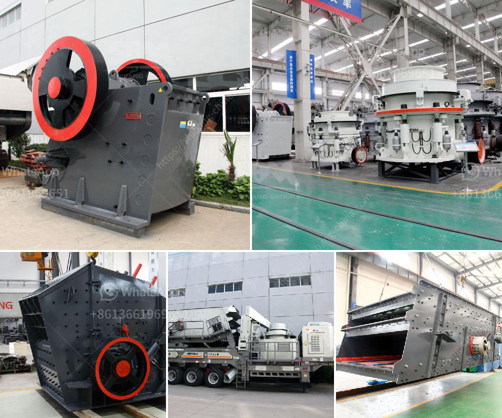

<h3>crusher machines supplier in philippines</h3>
In recent years, the Philippine government has been investing heavily in infrastructure development projects such as road construction, building construction, and bridge construction. This surge in construction activities has led to an increase in demand for aggregates, making the Philippines a lucrative market for suppliers of crusher machines. As a result, numerous crusher machines suppliers are present in the market, each offering different types of crusher machines with different specifications.

Crusher machines are designed for stone processing as well as some other raw materials mining. They can be not only used for crushing ores and stones, but also used for dealing with construction wastes. Crushing equipment has widely applications in many fields, such as mining industry, construction industry, metallurgy industry, chemical industry and so on.

Crusher machines are for sale in the Philippines and in various other countries and regions in the world. With a wide range of applications, they are used in various industries and fields. Crushing machines are designed to break large stones, rocks, coal, or construction waste into smaller sizes. They are generally used as primary crushers in majority of crushing processes regardless of the industry.

Jaw crusher machines are the most common type of crushing machines in mining industry. There are many different types of crushing machines produced by different manufacturers in the market, such as jaw crusher machines, impact crusher machines, cone crusher machines, roller crusher machines, hammer crusher machines and so on.

The crusher machines used in stone crushing plant from SBM includes the jaw crusher machine, cone crusher machine, impact crusher machine and mobile crusher machine.

Each of them has different models and can be used in different application industry. The jaw crusher machine has higher crushing ratio, can be used for primary crushing of different raw materials. The cone crusher is mainly used for secondary crushing purposes while the impact crusher and the mobile crusher plants are used for further processing like recycling and disposal of construction waste.

For crusher machines, there are some common types, such as jaw crusher machines, cone crusher machines, impact crusher machines and so on. All of them have their own advantages and disadvantages. Jaw crusher machines have movable jaw plate to exert force on the rock materials, which can easily crush them into smaller rocks. Cone crusher machines are suitable for processing rocks with high hardness like granite. Impact crusher machines can process rocks with medium hardness like impact crusher machines.

When choosing a crusher machine, you should consider the raw materials you need to crush, the feeding size, the required final size and whether you need the primary crushing or the secondary crushing. Some jaw crushers are necessary to crush material from the top of the machine to the bottom, while some jaw crushers are less complicated and just crush rock from the front and bottom. It is essential to know the capabilities of the machine before purchasing it.

In the Philippines, crusher machines have been sold widely. In fact, crusher machines have been sold in different countries. With more than 30 years of experience in crusher machine manufacturing field, SBM has sold countless sets of crushing machines working in different lands.

With reliable performance, reasonable design, easy operation, and high efficiency, the crusher machines in SBM have been highly praised by local mass production customers in Philippines, which have achieved the requirements of the local production with excellent performance.

In conclusion, crusher machines are an essential part of any construction project in the Philippines. With the increased investment in construction projects and more people needing construction materials, reliable crusher machines are in high demand. A reliable supplier with a wide range of crusher machines and a reputation for quality and reliability is essential.
<h3>Contact us</h3><ul><li><strong>Whatsapp:&nbsp;<a href="https://wa.me/8613661969651">+8613661969651</a></strong></li><li><a href="https://swt.shibang-china.com/?git&amp;zhl&amp;crusher machines supplier in philippines"><strong>Online Service(chat now)</strong></a></li></ul><h3>Related</h3><ul><li><a href='cost of concrete batch plant.md'>cost of concrete batch plant</a></li><li><a href='study of a fero chrome crushing plant.md'>study of a fero chrome crushing plant</a></li><li><a href='mobile stone crusher price in zimbabwe.md'>mobile stone crusher price in zimbabwe</a></li><li><a href='coal screening equipment price.md'>coal screening equipment price</a></li><li><a href='ball and pebble mills.md'>ball and pebble mills</a></li></ul>