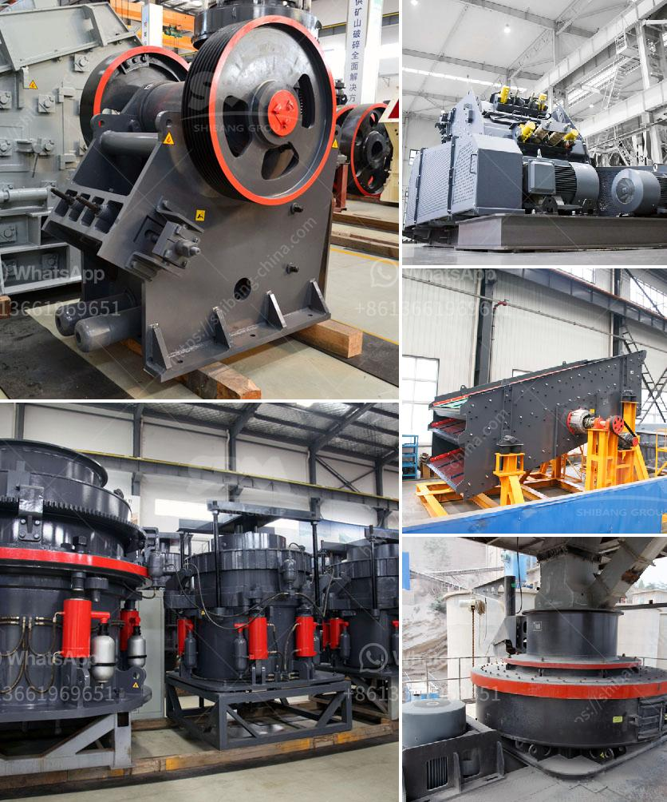

<h3>crusher manufacturer in pune ie</h3>
Crusher manufacturers in Pune are known for their state-of-the-art manufacturing facility that produces high-quality crushers in Pune. Industries such as mining, construction, metallurgy, and chemical use crushers to break down raw materials to their desired size and shape. These machines significantly reduce the size of larger rocks, gravel, or concrete for easy transportation and further processing.

One of the key factors that make crusher manufacturers in Pune standout is their focus on innovation and continuous product development. These manufacturers invest heavily in research and development to introduce advanced technologies and features in their crushers. This ensures that their customers get access to cutting-edge equipment that meets their specific requirements.

Moreover, crusher manufacturers in Pune follow stringent quality control measures at every stage of the production process. From sourcing raw materials to final assembly, these manufacturers ensure that their crushers are durable, efficient, and reliable. This commitment to quality has earned them a reputation for excellence in the industry.

Another advantage of choosing crusher manufacturers in Pune is their comprehensive after-sales support. These manufacturers offer timely servicing, maintenance, and spare parts availability, reducing downtime for their customers. With a well-established network of service centers, customers can count on prompt assistance whenever required.

Furthermore, crusher manufacturers in Pune also prioritize environmental sustainability. They adopt eco-friendly practices in their manufacturing processes and ensure that their crushers comply with all relevant environmental regulations. This allows businesses to not only contribute towards sustainable development but also adhere to legal requirements.

In conclusion, choosing a crusher manufacturer in Pune ensures access to top-notch crushers that cater to diverse industrial needs. These manufacturers deliver advanced, efficient, and durable equipment backed by comprehensive after-sales support. With their commitment to quality and environmental sustainability, crusher manufacturers in Pune have emerged as trusted partners for businesses across various sectors.
<h3>Contact us</h3><ul><li><strong>Whatsapp:&nbsp;<a href="https://wa.me/8613661969651">+8613661969651</a></strong></li><li><a href="https://swt.shibang-china.com/?git&amp;zhl&amp;crusher manufacturer in pune ie"><strong>Online Service(chat now)</strong></a></li></ul><h3>Related</h3><ul><li><a href='cost of copper ore processing plant.md'>cost of copper ore processing plant</a></li><li><a href='business plan for stone quarry crusher pdf.md'>business plan for stone quarry crusher pdf</a></li><li><a href='second hand jaw crusher for sale in harare.md'>second hand jaw crusher for sale in harare</a></li><li><a href='primary jaw crusher for limestone.md'>primary jaw crusher for limestone</a></li><li><a href='quarry stone for sale in malta.md'>quarry stone for sale in malta</a></li></ul>