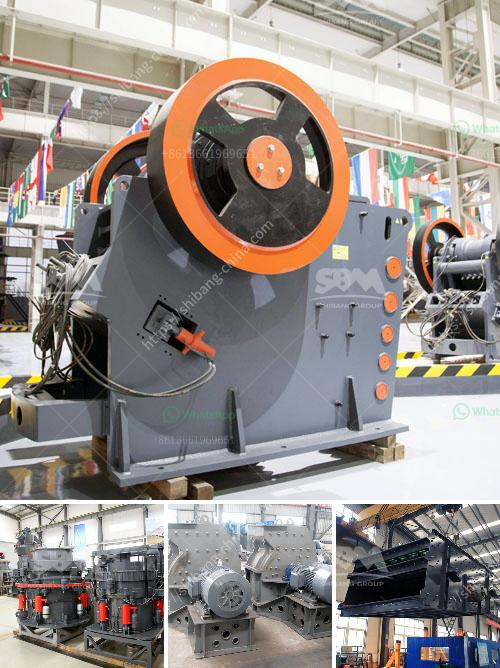

<h3>crusher manufacturers in hyderabad</h3>
Crusher machines are commonly used for reducing the size of stones, minerals and ores in various industries such as mining, construction, metallurgy, highways, chemistry, and railways. The extensive use of crushers in these industries have resulted in a healthy growth in the market for crusher manufacturers in Hyderabad.

In recent years, Hyderabad has emerged as one of the leading hubs for crusher manufacturing companies. The quality of the products has been widely appreciated and these companies have earned a reputation for manufacturing crushers that are reliable and durable.

One of the key factors that contribute to the success of these manufacturers is the availability of skilled labor. The city of Hyderabad is home to several technical institutes that specialize in training individuals in the field of engineering. As a result, there is a large pool of skilled technicians and engineers who are capable of operating and maintaining the crusher machines efficiently.

In addition to the availability of skilled labor, the city of Hyderabad also has a well-established network of suppliers and vendors who provide the necessary raw materials required for manufacturing crushers. These suppliers ensure the timely delivery of high-quality raw materials, thereby enabling the manufacturers to meet the demand of the market.

Furthermore, the crusher manufacturers in Hyderabad have adopted advanced manufacturing techniques to improve the efficiency and productivity of their machines. They have invested in state-of-the-art machinery and equipment to achieve faster production cycles and higher levels of precision.

Another important aspect that sets the crusher manufacturers in Hyderabad apart from others is their focus on research and development. These companies have dedicated teams of engineers and researchers who work tirelessly to develop innovative solutions and improve the performance of their crushers. This continuous investment in R&D allows them to stay ahead of the competition and offer cutting-edge products to their customers.

In terms of market size, the crusher manufacturing industry in Hyderabad is estimated to be worth several crores. The market is highly competitive, with several players catering to different segments and niches. Some manufacturers specialize in producing crushers for specific industries, while others provide a wide range of products to meet the diverse needs of their customers.

Despite the intense competition, crusher manufacturers in Hyderabad have managed to thrive by focusing on customer satisfaction and after-sales service. They understand the importance of building long-term relationships with their customers and provide prompt technical support and maintenance services.

To summarize, the crusher manufacturing industry in Hyderabad has witnessed significant growth in recent years. The presence of skilled labor, a strong supply chain, advanced manufacturing techniques, focus on research and development, and a customer-centric approach have contributed to the success of these manufacturers. As the demand for crushers continues to rise, the crusher manufacturers in Hyderabad are poised to play a vital role in meeting this demand and driving the growth of the industry.
<h3>Contact us</h3><ul><li><strong>Whatsapp:&nbsp;<a href="https://wa.me/8613661969651">+8613661969651</a></strong></li><li><a href="https://swt.shibang-china.com/?git&amp;zhl&amp;crusher manufacturers in hyderabad"><strong>Online Service(chat now)</strong></a></li></ul><h3>Related</h3><ul><li><a href='30 tons per hour cost.md'>30 tons per hour cost</a></li><li><a href='chrome beneficiation plant design.md'>chrome beneficiation plant design</a></li><li><a href='feasiblity study of a fero chrome crushing plant.md'>feasiblity study of a fero chrome crushing plant</a></li><li><a href='feldspar powder plants in andhra pradesh.md'>feldspar powder plants in andhra pradesh</a></li><li><a href='copper concentrate sellers suppliers manufacturers.md'>copper concentrate sellers suppliers manufacturers</a></li></ul>