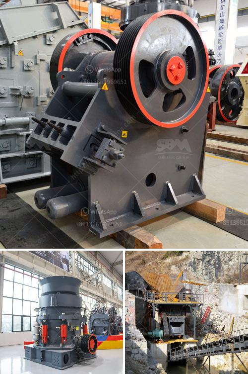

<h3>crusher manufacturers in south africa</h3>
South Africa is a developing country with a diverse middle class and a growing economy. However, the country faces significant challenges that affect the manufacturing industry, including power shortages and a lack of skilled labor. Despite these obstacles, South Africa is home to several crusher manufacturers that supply quality machines to the mining, quarrying, and construction industries.

1. Osborn Engineered Products: With over a century of experience, Osborn is one of South Africa's foremost manufacturers of equipment for the mining and quarrying industries. Their extensive range includes jaw crushers, cone crushers, and impact crushers.

2. Metso South Africa (Pty) Ltd: Metso is a global supplier of sustainable solutions for mining, construction, recycling, and oil & gas industries. They offer a wide range of crushing, screening, and grinding equipment, as well as mobile and stationary solutions for mineral processing plants.

3. Pilot Crushtec International: Founded in 1990, Pilot Crushtec is a leading supplier of mobile and semi-mobile crushing, screening, recycling, sand washing, stockpiling, and compacting solutions. They offer a comprehensive range of crushers, from jaw crushers to cone crushers and vertical shaft impactors.

4. Bell Equipment Co SA: Bell Equipment is a South African manufacturer and distributor of heavy-duty earthmoving, loading, and hauling equipment. They also provide crushers and other construction equipment for various applications, including mining, quarrying, and road construction.

Despite the challenges faced by the industry, South African crusher manufacturers continue to innovate and develop cost-effective solutions for the mining and construction sectors. Their expertise and commitment to quality have made them reliable partners for local and international clients.

Furthermore, these manufacturers are not only focused on product development but also on providing after-sales support and services. This includes regular maintenance, spare parts availability, and technical assistance, ensuring that customers can maximize the lifespan and productivity of their equipment.

In conclusion, South Africa is home to reputable crusher manufacturers that supply reliable machines for various industries. Their commitment to quality and customer satisfaction has helped them overcome challenges and establish a strong presence in the global market.
<h3>Contact us</h3><ul><li><strong>Whatsapp:&nbsp;<a href="https://wa.me/8613661969651">+8613661969651</a></strong></li><li><a href="https://swt.shibang-china.com/?git&amp;zhl&amp;crusher manufacturers in south africa"><strong>Online Service(chat now)</strong></a></li></ul><h3>Related</h3><ul><li><a href='aggregate crusher 200 meter capacity.md'>aggregate crusher 200 meter capacity</a></li><li><a href='quartz crusher plant manufacturers in india.md'>quartz crusher plant manufacturers in india</a></li><li><a href='ballast crusher in kenya made in china.md'>ballast crusher in kenya made in china</a></li><li><a href='crusher application.md'>crusher application</a></li><li><a href='stone crusher mini type.md'>stone crusher mini type</a></li></ul>