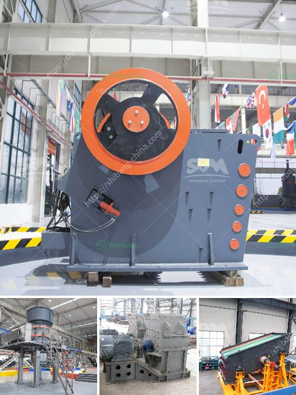

<h3>crusher peru price</h3>
Peru, known for its abundant mineral resources, has become one of the top countries for mining operations in Latin America. As mining activities continue to grow in Peru, the demand for quality mining machinery also increases. One of the crucial pieces of equipment in the mining industry is the crusher, used to break down rocks and ores into smaller pieces for further processing.

When considering the price of a crusher in Peru, several factors come into play. The size and type of crusher, as well as its capacity and power requirements, affect its cost. Additionally, the brand reputation, production quality, and after-sales service provided by the manufacturer also impact the final price. Let's delve deeper into these aspects to understand the pricing dynamics of crushers in Peru.

Firstly, the size and type of crusher play a significant role in determining its price. Crushers come in various sizes, ranging from small scale or portable crushers to large-scale industrial ones. It's vital to choose the right size and type of crusher depending on the mining operation's specific requirements. The more features and capabilities a crusher possesses, the higher the price it commands.

Capacity and power requirements are another crucial aspect influencing the price of a crusher. Higher-capacity machines typically have a higher price tag, as they require more powerful motors and materials to manufacture. Larger crushers can process a greater amount of material in a shorter time, making them more efficient for large-scale mining operations. However, smaller mines or those with lower production volumes may opt for crushers with lower capacities to match their needs and budgets.

Brand reputation is an essential factor to consider when evaluating the price of a crusher. Established and reputable brands often charge a premium due to their reliability, durability, and proven track records. Investing in a well-known brand may mean a higher upfront cost, but it can potentially save money in the long run by reducing maintenance and repair expenses.

Production quality is another element influencing the price of a crusher. Crushers made from high-quality materials tend to be more expensive upfront. They often last longer, reducing the need for frequent replacements or repairs. Moreover, the overall build and design of the crusher impact its efficiency and performance, making a difference in productivity and ultimately affecting the mining operation's profitability.

Lastly, after-sales services provided by the manufacturer should not be overlooked. A company that offers comprehensive customer support, including technical assistance, spare parts availability, and warranty coverage, may justify a higher price due to the added value it brings. Reliable after-sales support can significantly minimize downtime and associated costs, ensuring smooth operations and maximizing the crusher's lifespan.

When considering the crusher Peru price, it is essential to assess the factors mentioned above and find the optimal balance between performance, quality, and affordability. Mining companies should carefully evaluate their specific needs, consult with reputable suppliers or manufacturers, and consider the long-term cost implications associated with different crusher options.

As Peru aims to expand its mining industry further, investing in high-quality crushers becomes increasingly critical. A well-chosen crusher can enhance productivity, improve efficiency, and contribute to a more sustainable and profitable mining operation. By weighing all the relevant factors, mining companies can make informed decisions and secure the most suitable crusher for their requirements while optimizing their return on investment.
<h3>Contact us</h3><ul><li><strong>Whatsapp:&nbsp;<a href="https://wa.me/8613661969651">+8613661969651</a></strong></li><li><a href="https://swt.shibang-china.com/?git&amp;zhl&amp;crusher peru price"><strong>Online Service(chat now)</strong></a></li></ul><h3>Related</h3><ul><li><a href='ball mills at best price in india.md'>ball mills at best price in india</a></li><li><a href='vertical grinder mill price.md'>vertical grinder mill price</a></li><li><a href='hammer mill new zealand.md'>hammer mill new zealand</a></li><li><a href='kenya roller mill.md'>kenya roller mill</a></li><li><a href='quartz ball mills hyderabad.md'>quartz ball mills hyderabad</a></li></ul>