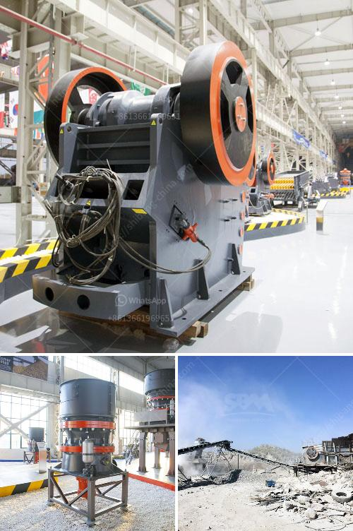

<h3>crusher philippines</h3>
When watching demolition shows or movies, we often witness piles of rubble and debris brought down to a manageable size by a massive machine. These machines are known as crushers, and they play an essential role in turning large pieces of rocks and stones into smaller gravel of various sizes. The Philippines is one of the countries blessed with an abundant supply of natural resources, making it a prime location for crushers to thrive and contribute to the country's construction industry.

Crushers are the unsung heroes among the equipment used in the mining and construction industries. Their unassuming appearance may undermine their significance, but the process of transforming rocks into gravel is vital for the development of infrastructure projects, such as building roads, bridges, and buildings.

One prominent crusher Philippines is the Jaw Crusher. This machine is often used for mining, construction, demolition, and recycling purposes. Built with the capability to crush rocks of up to 30 inches across, a jaw crusher can quickly take on large quantities of material, reducing it in size by up to 80%. The jaw crusher uses a compressive force, compressing and crushing the material in the crushing chamber. This force is achieved indirectly through the two vertical jaws of the machine, which can be opened or closed. The opening and closing action allows for the material to be broken down into smaller sizes.

Another essential crusher Philippines is the Impact Crusher. As the name suggests, this machine uses a forceful impact to crush rocks in its crushing chamber. It is commonly used for recycling, cement production, and limestone mining. The impact crusher has a durable structure with a high-strength welding and is fitted with destination plates. Its rotor is designed to rotate at a high speed to maximize the impact of the hammers, eventually breaking the rocks into smaller sizes.

Moreover, Cone Crushers, also commonly known as gyratory crushers, utilize an eccentric motion to crush rocks and ores. They may be used as primary or secondary crushers, depending on the application. Cone crushers reduce particles by squeezing and compressing the material between an eccentrically rotating mantle and a concave bowl liner. This action produces a controlled and consistent product size that is desirable for construction projects.

Furthermore, mobile crushers have also gained popularity in the Philippines. Mobile crushers are versatile and can process rocks and stones with ease. They can be used to crush and recycle construction materials, reducing waste and providing useful aggregate for future projects. These crushers are portable and can be transported to different locations, making them ideal equipment for businesses involved in on-site crushing operations.

In conclusion, crushers play an integral role in the development of the Philippines, providing an efficient way of reducing large pieces of rocks into smaller gravel that is essential in the construction industry. The variety of crushers available in the market ensures that there is a suitable machine for every project. From jaw crushers to impact crushers, and cone crushers to mobile crushers, the Philippines is fortunate to have crushers that meet different requirements and specifications. These crushers are the unsung heroes that contribute to the country's progress and development, one crushed rock at a time.
<h3>Contact us</h3><ul><li><strong>Whatsapp:&nbsp;<a href="https://wa.me/8613661969651">+8613661969651</a></strong></li><li><a href="https://swt.shibang-china.com/?git&amp;zhl&amp;crusher philippines"><strong>Online Service(chat now)</strong></a></li></ul><h3>Related</h3><ul><li><a href='sample business plan for a stone mining.md'>sample business plan for a stone mining</a></li><li><a href='difeerence between jow crusher and hammer mill.md'>difeerence between jow crusher and hammer mill</a></li><li><a href='stone crusher plant tph layout.md'>stone crusher plant tph layout</a></li><li><a href='mining equipment for sale zimbabwe.md'>mining equipment for sale zimbabwe</a></li><li><a href='jual mesin hammer mill crusher for sale.md'>jual mesin hammer mill crusher for sale</a></li></ul>