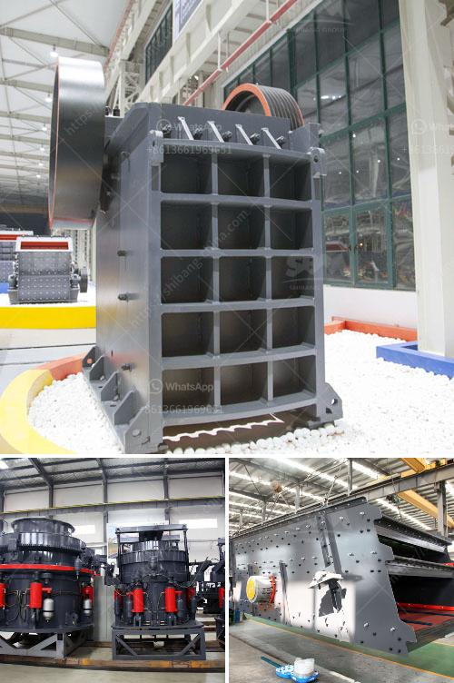

<h3>crusher plant design</h3>
Crusher plant design is specially develop to ore and mineral in SBM. Our crushing plant design by our professional team and provide many crusher machine for sale. Crushing plant design has adequate capability to excel within the quarrying industry. Our primary objective would be to set up a crusher in the quarry gravel plant that would produce the product fractions necessary to satisfy your unique needs.

The crusher plant design is a complete production line for building materials. Nowadays, there are many different types of building materials, crushers in the market, such as jaw crushers, cone crushers, impact crushers, hammer crushers, etc. They have different properties and uses in the actual production process. Therefore, when selecting the crusher, it is necessary to select a suitable crusher according to the characteristics of the materials.

The crusher plant design should be located on the total plan according to the general layout and the input and output materials direction to determine. After scouting the location for our crushing plant site, we are ready to proceed with the plant design. Also to note, we are taking into consideration the mobility of the equipment to use so as to minimize transportation expenses.

The primary goal for the design of a crushing plant is an installation that meets the necessary production requirements, operates at competitive cost and complies with today’s tough environmental regulations. Each crushing plant comes ready to operate with its own feed hopper, feed conveyor, discharge conveyor, and electric drive motor.

Crushing plant will need you have a certain amount of capital before starting to improve the concentrator feed bin broken ore across the entire particle size will be constant. The maximum diameter of the particles must not exceed 80% of the diameter of the feed port. The maximum depth of the feed into the mine mouth may not exceed 0.2 times the diameter, and crushing the particle size of particles and moisture content has a close relationship. If the water content exceeds 10%, the fine crusher should also be equipped.

The primary purpose of crushing plant design is to make sure you have as much detail on your project as possible before you engage suppliers. It saves you time and money when you negotiate with suppliers if you know exactly what you want. Most crushing plants are now designed on the lines shown in Fig. 1, which is a diagrammatic view of a two-stage arrangement. The ore from the mine is dumped in the coarse ore bin, from which an automatic feeder delivers it over a grizzly to the primary breaker, the latter being of the jaw type in the case of a small plant and of the gyratory type in the case of a large one.

Overall, the crusher plant design is based on the design principle of the customers and is reasonable. The operation cost and maintenance cost of the crushing equipment is low and the production efficiency is high. It is stable in performance and has a long service life. The maintenance work is carried out easily and the operation is convenient and reliable. Therefore, crusher plant is widely used in many sectors such as mining, smelting, building materials, highway, railway, water conservancy and chemical industry.
<h3>Contact us</h3><ul><li><strong>Whatsapp:&nbsp;<a href="https://wa.me/8613661969651">+8613661969651</a></strong></li><li><a href="https://swt.shibang-china.com/?git&amp;zhl&amp;crusher plant design"><strong>Online Service(chat now)</strong></a></li></ul><h3>Related</h3><ul><li><a href='high pressure grinding mill.md'>high pressure grinding mill</a></li><li><a href='stone crusher machine manufacturer in gujarat.md'>stone crusher machine manufacturer in gujarat</a></li><li><a href='material of conveyor belts.md'>material of conveyor belts</a></li><li><a href='crushing plant thailand.md'>crushing plant thailand</a></li><li><a href='german technology ball grinding machine.md'>german technology ball grinding machine</a></li></ul>