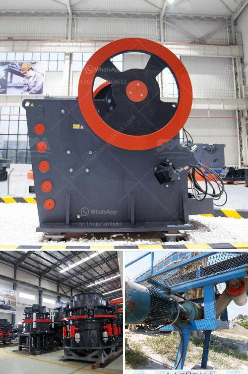

<h3>crusher plants for sale in south africa</h3>
Crusher plants for sale in South Africa are widely used in the mining industry. Its economic importance is undeniable, as it contributes to the country's GDP and employs numerous individuals in the sectors such as construction, transportation, and manufacturing. However, finding the right crusher plant for sale can be a daunting task, given the wide range of options available. In this article, we will discuss the various types of crusher plants available in South Africa and their potential benefits.

One of the most common types of crusher plants is the mobile crushing plant. This plant allows companies to crush materials directly on-site, eliminating the need for transportation and reducing costs. Additionally, mobile crusher plants are highly versatile and can be used for various applications such as recycling, quarrying, and mining. The mobility and flexibility of these plants make them an ideal choice for on-the-go operations.

Another popular option is the fixed crushing plant. Contrary to mobile plants, fixed crusher plants are designed to be installed in a specific location and cannot be easily moved. While they may lack mobility, they make up for it in terms of processing power and production capacity. Fixed crushing plants are particularly suitable for large-scale mining operations where a continuous supply of materials is required.

In recent years, there has been a growing demand for environmentally friendly crusher plants. As the focus on sustainable development increases, companies are inclined towards eco-friendly solutions that minimize their carbon footprint. Eco-friendly crusher plants utilize advanced technologies such as hybrid engines or electric motors, reducing emissions and operating costs. Moreover, these plants often come equipped with dust suppression systems and noise reduction features, making them more environmentally responsible.

When purchasing a crusher plant in South Africa, it is crucial to consider the quality and reliability of the equipment. Since crusher plants handle raw materials and are constantly subjected to heavy loads, it is essential to invest in high-quality machinery to ensure long-term productivity. Reputable manufacturers and suppliers offer durable and reliable crusher plants that are built to withstand harsh conditions and deliver consistent performance.

Furthermore, after-sales service and support should also be taken into account. A reputable supplier should offer regular maintenance and spare parts services to ensure that the crusher plant operates smoothly and is quickly restored in the event of a breakdown. Adequate training and technical assistance should also be provided to operators to optimize the performance of the plant and minimize downtime.

In conclusion, crusher plants for sale in South Africa are essential for the mining industry's operations and contribute significantly to the country's economic development. The mobile and fixed crushing plants offer various advantages, depending on the specific requirements of the operation. Additionally, the availability of eco-friendly crusher plants highlights the industry's commitment to sustainable practices. Potential buyers should prioritize the quality and reliability of the equipment and choose suppliers that offer excellent after-sales service and support.
<h3>Contact us</h3><ul><li><strong>Whatsapp:&nbsp;<a href="https://wa.me/8613661969651">+8613661969651</a></strong></li><li><a href="https://swt.shibang-china.com/?git&amp;zhl&amp;crusher plants for sale in south africa"><strong>Online Service(chat now)</strong></a></li></ul><h3>Related</h3><ul><li><a href='drywall grinding for gypsum.md'>drywall grinding for gypsum</a></li><li><a href='mobile crusher cone france.md'>mobile crusher cone france</a></li><li><a href='dolomite stone crusher plant.md'>dolomite stone crusher plant</a></li><li><a href='south africa manufacturer of mobile gold processing plant.md'>south africa manufacturer of mobile gold processing plant</a></li><li><a href='ball mill grinding micronizer.md'>ball mill grinding micronizer</a></li></ul>