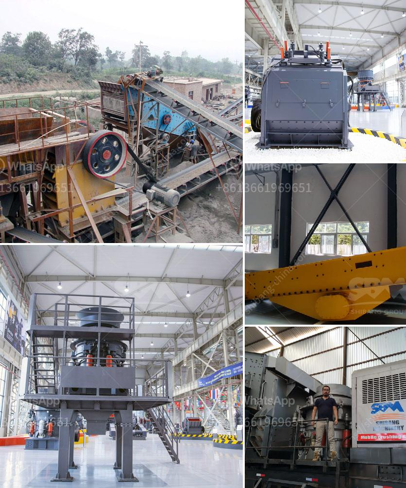

<h3>crusher plants in pakistan</h3>
Crusher plants in Pakistan play a vital role in the construction industry. However, they also have an impact on the environment. Therefore, it is crucial to carefully consider various factors before choosing a crusher plant for your construction projects.

A crusher plant is a machine designed to reduce the size of large rocks into smaller rocks, gravel, or rock dust. It utilizes a mechanical force to achieve this reduction, and it comes in different sizes and configurations to fit different crushing needs. Crusher plants are widely used in the construction industry for crushing different types of rocks, such as limestone, granite, and gravel.

One of the primary factors to consider when selecting a crusher plant is its capacity. The capacity of a crusher plant determines how much material it can process at a given time. If you have high-volume crushing needs, it is essential to choose a crusher plant with a high capacity to ensure smooth and efficient operation.

Another critical factor to consider is the type of material the crusher plant can process. Some plants are specifically designed for handling specific types of rocks, such as limestone or granite. It is crucial to match the type of material with the appropriate crusher plant to achieve the desired results. Using the wrong type of crusher can lead to poor quality materials or even damage to the machine.

Additionally, it is essential to consider the durability and reliability of the crusher plant. Construction projects often involve demanding conditions, such as high temperatures, dust, and vibrations. Therefore, the chosen crusher plant should be able to withstand these conditions without compromising its performance or longevity. Investing in a durable and reliable crusher plant can save you from costly repairs or replacements in the future.

Furthermore, the environmental impact of crusher plants cannot be ignored. Crushing rocks produces dust, noise, and vibration, which can have adverse effects on the surrounding environment and communities. It is essential to choose a crusher plant that incorporates proper dust control measures and noise reduction techniques to minimize its impact on the environment and neighboring areas.

In addition to environmental considerations, it is crucial to comply with local regulations and obtain the necessary permits and licenses for operating a crusher plant. Each country and region may have specific regulations regarding quarrying and crushing activities. It is important to familiarize yourself with these regulations and ensure that your crusher plant operates within the legal framework.

In conclusion, crusher plants in Pakistan are vital for the construction industry, but it is crucial to choose the right machine for your crushing needs, considering factors such as capacity, type of material, durability, and environmental impact. By selecting the right crusher plant and implementing proper measures, you can ensure efficient crushing operations while minimizing the impact on the environment.
<h3>Contact us</h3><ul><li><strong>Whatsapp:&nbsp;<a href="https://wa.me/8613661969651">+8613661969651</a></strong></li><li><a href="https://swt.shibang-china.com/?git&amp;zhl&amp;crusher plants in pakistan"><strong>Online Service(chat now)</strong></a></li></ul><h3>Related</h3><ul><li><a href='mobile crushers for hire in gauteng south africa.md'>mobile crushers for hire in gauteng south africa</a></li><li><a href='griding machine zenith.md'>griding machine zenith</a></li><li><a href='iron ore smelter equipment.md'>iron ore smelter equipment</a></li><li><a href='mobile crusher machine.md'>mobile crusher machine</a></li><li><a href='dolomite mining plant price.md'>dolomite mining plant price</a></li></ul>