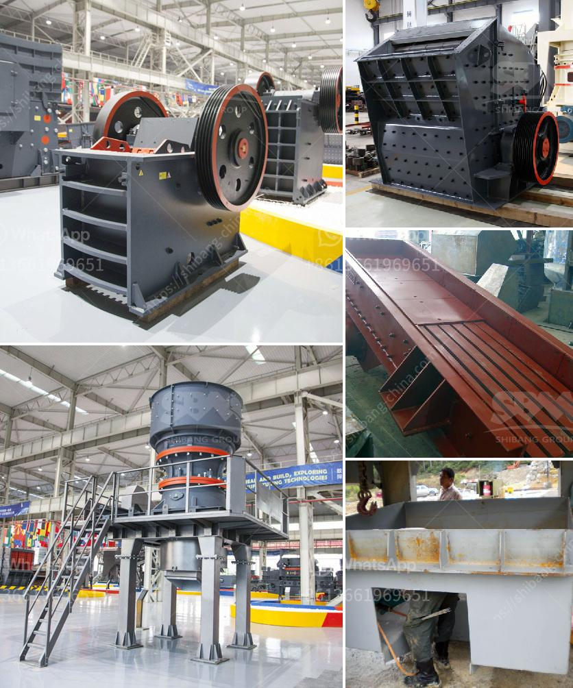

<h3>crusher price malaysia</h3>
Malaysia is a growing economy, and with that, comes an increase in construction and infrastructure projects. High-quality materials are essential for the durability and longevity of these projects, and this is where crushers come into play. Crushers are heavy machinery used to break large stones into smaller fragments, making them suitable for construction purposes. As the demand for crushers increases, so does the price in Malaysia.

One of the main factors contributing to the price of crushers in Malaysia is the availability of raw materials. Malaysia is rich in granite, limestone, and other natural resources, making it a prime location for quarrying activities. However, the extraction and processing of these materials involve significant costs, which are passed on to consumers. Additionally, fluctuations in fuel and electricity prices also impact the overall price of crushers.

Another factor that affects crusher prices in Malaysia is the level of competition among manufacturers. As more companies enter the market, the competition intensifies, leading to competitive pricing strategies. This is beneficial for consumers as it gives them a wider range of options at different price points. However, it is essential to note that while price is a crucial factor, the quality and reliability of the crusher should not be compromised.

The type and size of the crusher also play a role in determining its price. There are various types of crushers available in the market, including jaw crushers, cone crushers, impact crushers, and vertical shaft impactors. Each type has its own advantages and applications, making them suitable for different construction requirements. Similarly, the size of the crusher also affects its price, with larger crushers generally being more expensive due to their increased capacity and power.

Additionally, the brand reputation and after-sales service provided by manufacturers can also impact the price of crushers in Malaysia. Established brands with a proven track record of delivering high-quality products and excellent customer service often command higher prices. Consumers are willing to pay a premium for these brands, knowing that they will receive reliable machinery and support throughout the lifespan of the crusher.

In recent years, there has been a trend towards environmentally friendly and energy-efficient crushers. These crushers are designed to minimize energy consumption and reduce emissions, aligning with global sustainability goals. While these crushers may have a higher initial cost, the long-term savings through reduced energy consumption and lower environmental impact make them an attractive option for many consumers.

In conclusion, the price of crushers in Malaysia is influenced by several factors, including the availability of raw materials, competition among manufacturers, type and size of the crusher, brand reputation, and environmental considerations. As the country's economy continues to grow, the demand for crushers will likely increase, leading to further advancements and innovations in this industry. It is important for consumers to consider their specific construction needs and budget when selecting a crusher, ensuring that they strike a balance between price and quality.
<h3>Contact us</h3><ul><li><strong>Whatsapp:&nbsp;<a href="https://wa.me/8613661969651">+8613661969651</a></strong></li><li><a href="https://swt.shibang-china.com/?git&amp;zhl&amp;crusher price malaysia"><strong>Online Service(chat now)</strong></a></li></ul><h3>Related</h3><ul><li><a href='sand washinng plant makers in srilanka.md'>sand washinng plant makers in srilanka</a></li><li><a href='coal crusher machine prices in india.md'>coal crusher machine prices in india</a></li><li><a href='used vertical grinder mill for sale.md'>used vertical grinder mill for sale</a></li><li><a href='stone crusher machine in malaysia.md'>stone crusher machine in malaysia</a></li><li><a href='looking for kaolin processing price.md'>looking for kaolin processing price</a></li></ul>