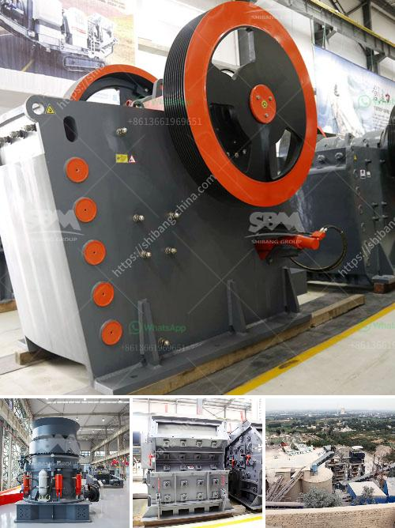

<h3>crusher prices stone crusher</h3>
Crusher prices vary greatly depending on the type of crusher, the production capacity, the size of the crushed materials, and the level of automation. There are numerous stone crushers available in the market that cater to different needs and requirements. Here, we will discuss the factors that influence crusher prices and help you understand the cost associated with purchasing a stone crusher.

Firstly, the type of crusher plays a significant role in determining the price. There are different types of stone crushers available, including jaw crushers, cone crushers, impact crushers, and VSI crushers. Jaw crushers are commonly used for coarse crushing, while cone crushers, impact crushers, and VSI crushers are used for medium to fine crushing.

Secondly, the production capacity of the crusher directly affects its price. Stone crushers with higher production capacities tend to be priced higher due to their ability to process more materials in a shorter time. Higher capacity crushers are generally used in larger mining operations or projects that require a significant amount of crushed materials.

Thirdly, the size of the crushed materials also influences the price. Some crushers are designed for smaller materials such as rocks, while others are suitable for larger stones or minerals. Crushers designed for larger materials generally have a higher price due to their robust construction and heavy-duty components.

Lastly, the level of automation is another important factor. Crushers with advanced automation features, such as electronic control systems and remote monitoring capabilities, are usually priced higher. These features allow for easier operation, increased productivity, and improved safety.

In conclusion, crusher prices for stone crushers vary depending on factors such as the type of crusher, production capacity, size of the crushed materials, and level of automation. It is essential to consider these factors when purchasing a stone crusher to ensure that you get the most cost-effective and efficient solution for your crushing needs.
<h3>Contact us</h3><ul><li><strong>Whatsapp:&nbsp;<a href="https://wa.me/8613661969651">+8613661969651</a></strong></li><li><a href="https://swt.shibang-china.com/?git&amp;zhl&amp;crusher prices stone crusher"><strong>Online Service(chat now)</strong></a></li></ul><h3>Related</h3><ul><li><a href='dry grinding ball mill.md'>dry grinding ball mill</a></li><li><a href='hammer mill 150 250.md'>hammer mill 150 250</a></li><li><a href='paint grinding ball mill.md'>paint grinding ball mill</a></li><li><a href='stone crusher usa.md'>stone crusher usa</a></li><li><a href='sand manufacturing plant.md'>sand manufacturing plant</a></li></ul>