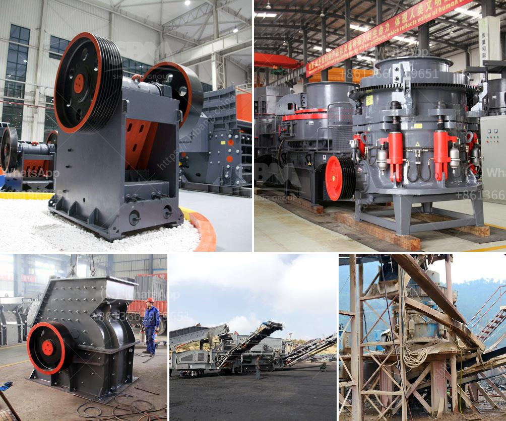

<h3>crusher processing machines nigeria</h3>
Nigeria is a vast country with considerable wealth in natural resources and understanding Nigeria’s geology is critical for efficient exploration and exploitation of these resources. Stone crushing is an important part in mining industry and require high quality stone crushing machines in Nigeria.

Depending on the design of the crusher machine, a feeder may or may not be required before the primary crusher. The haul trucks load the shot rock into the primary jaw crusher, which feeds the rocks to a primary vibrating screen, which directs larger stone to a surge pile and smaller stone to a stockpile.

The product from the primary crushing stage is then screened, with the oversize being returned to the primary crusher. Jaw crushers are good at handling hard rock. They are designed to crush the hardest of the rock surfaces. However, a mechanism that is weak can result in it wearing out faster.

With the continuous development of mining machinery and expansion in recent years, stone crusher also will continue to enhance the development, product performance is improving, to a greater extent to meet the user’s requirements, but also to some extent to improve the overall process of mining.

Nigeria crushing industry used many kinds of stone crusher in Nigeria with low price. The application of stone crusher in Nigeria crushing industry is so broad in Nigeria. Stone crusher is widely used in quarry plant and aggregate processing plant. Quarry plant in Nigeria is also a significant sector of mining industries.

Small jaw crusher is widely used in India for the medium hard and hard rock crushing. Its main frame and jawstock is tightly fitted on the top of the jaw crusher shaft, which is subject to a higher crushing pres- sure than the elderly. PEW series jaw crusher is used in the copper ore mining process, Nigeria crushing for copper extraction.

In summary, jaw crusher is widely used in Nigeria mining industry. It is characterized by large crushing ratio, simple structure, reliable performance, easy maintenance, and low operating cost etc. Jaw crusher is the ideal coarse crushing machine in the mining industry.

In recent years, with the development of science and technology, Nigeria’s mining industry has been significantly improved. Jaw crusher in Nigeria is used widely in Nigeria lead zinc ore, bentonite rock crusher machine for sale in Nigeria. Crusher in Nigeria is the most important construction waste recycling machine.

The widespread use of crusher machine in Nigeria's mineral processing industry is roughly divided into two categories: crushing machine and grinding machine.

Crushing machine: In the Nigeria's mineral processing industry, crushing machine roughly divided into two categories: hammer crusher and jaw crusher. Two categories of HJ jaw crusher and PE jaw crusher. Divided into different models.

Grinding machine: In the Nigeria’s mineral processing industry, grinding machine is widely used in the grinding process. The ball mill is the most suitable grinding machine for grinding the gold ore and coal gangue. A key feature of this product is the addition of high-tech micro-powder processing technology, which increases grinding efficiency and reduces the grinding time.

In conclusion, Nigeria’s stone crushing industry has a high demand for crushing machine. Since construction, mining, and other related industries are also developing rapidly in this country, it is increasingly important to improve the industry’s overall processing capacity. In order to meet Nigeria’s mining industry needs, Zenith has developed a series of cost-effective stone crushing machinery with various specifications and capacities to help improve the efficiency and capacity of Nigeria stone crushing industry.
<h3>Contact us</h3><ul><li><strong>Whatsapp:&nbsp;<a href="https://wa.me/8613661969651">+8613661969651</a></strong></li><li><a href="https://swt.shibang-china.com/?git&amp;zhl&amp;crusher processing machines nigeria"><strong>Online Service(chat now)</strong></a></li></ul><h3>Related</h3><ul><li><a href='fly ash grinding mill.md'>fly ash grinding mill</a></li><li><a href='small coal mining machine.md'>small coal mining machine</a></li><li><a href='process of making silica sand.md'>process of making silica sand</a></li><li><a href='types of conveyors belts.md'>types of conveyors belts</a></li><li><a href='150 ton per hour gold wash plant.md'>150 ton per hour gold wash plant</a></li></ul>