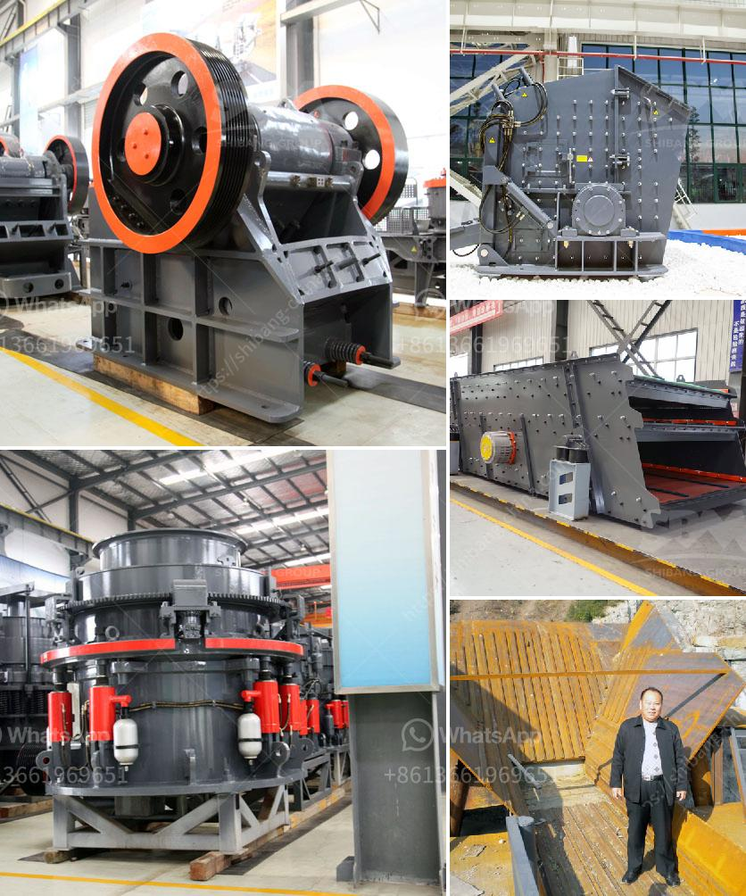

<h3>crusher screener forsale in sweden</h3>
Sweden, known for its innovation in mining equipment, has been leading the charge in developing top-notch machinery for various industries. One such technological marvel is the crusher screener, a machine that has revolutionized the construction sector. With advanced features and unmatched efficiency, buying a crusher screener for sale in Sweden can significantly enhance your project's productivity and reduce costs.

Crusher screeners are versatile machines used for crushing and screening materials such as stones, mineral ores, rocks, and aggregates. They are well-suited for construction projects, road building, mining operations, and recycling applications. These machines are capable of efficiently reducing the size of large materials into smaller, more manageable pieces.

One of the key advantages of crusher screeners is their mobility. Many models are designed to be compact and easily transportable, making them ideal for on-site crushing and screening. This enables construction companies to process materials directly at the job site, eliminating the need to transport them to a centralized location. Not only does this save time and money, but it also minimizes the environmental impact associated with transportation.

In Sweden, there is a wide range of crusher screeners available for sale, catering to different project requirements. From compact machines suitable for small-scale operations to larger, high-capacity models capable of handling massive quantities of material, there is a screener to fit every need. Moreover, the Swedish machinery market offers both new and used options, allowing buyers to choose based on their budget and specific application.

When considering a crusher screener for sale, it's important to assess the machine's performance and features. Swedish manufacturers are renowned for their commitment to quality and innovation, so buyers can expect cutting-edge technology, durability, and reliability. Many crushers and screeners come equipped with user-friendly controls, ensuring ease of operation even for inexperienced operators. Additionally, advanced automation and safety features make these machines efficient and secure to use.

The cost-effectiveness of a crusher screener is another significant advantage. By investing in this equipment, construction companies can save substantial amounts of money in the long run. The ability to produce aggregates on-site reduces the need for purchasing materials from external suppliers, saving transportation and material costs. Furthermore, the efficient nature of these machines ensures maximum utilization of raw materials, minimizing waste and lowering expenses.

In conclusion, crusher screeners for sale in Sweden offer a range of benefits for the construction industry. Their mobility, versatility, and cost-effectiveness make them a valuable asset for any project. With advanced features and a variety of models available, buyers in Sweden have access to top-notch machinery suited for their specific needs. Investing in a crusher screener not only enhances productivity but also demonstrates a commitment to sustainable construction practices. So, if you're looking to optimize your construction operations, consider a crusher screener for sale in Sweden and experience the difference firsthand.
<h3>Contact us</h3><ul><li><strong>Whatsapp:&nbsp;<a href="https://wa.me/8613661969651">+8613661969651</a></strong></li><li><a href="https://swt.shibang-china.com/?git&amp;zhl&amp;crusher screener forsale in sweden"><strong>Online Service(chat now)</strong></a></li></ul><h3>Related</h3><ul><li><a href='looking for used pulverizer machine.md'>looking for used pulverizer machine</a></li><li><a href='modeling clay process plant.md'>modeling clay process plant</a></li><li><a href='service de carbonate de calcium de broyage.md'>service de carbonate de calcium de broyage</a></li><li><a href='project report on m sand.md'>project report on m sand</a></li><li><a href='german technology ball grinding machine.md'>german technology ball grinding machine</a></li></ul>