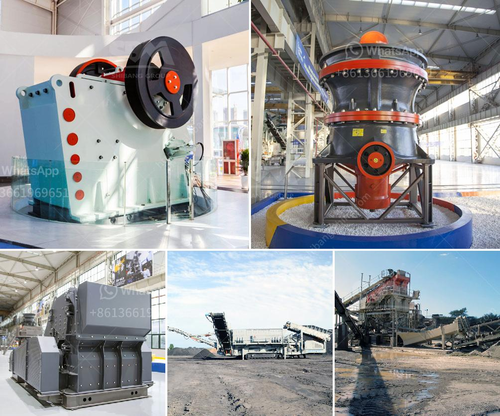

<h3>crusher sri lanka</h3>
Crusher Sri Lanka is widely used in various industries for crushing ore, rocks, and stones that are in high demand. Crushers are designed to break down large chunks of rock into smaller pieces that can be further processed by other machines to produce aggregates or other important materials used in construction, manufacturing, and other industries. Sri Lanka has been a hub for crusher manufacturing, which has significantly contributed to the country's economic growth and development.

One of the primary industries that utilize crushers in Sri Lanka is the construction industry. Crushers are essential equipment in construction projects, as they are used to break down rocks and stones into smaller sizes for use in building roads, bridges, buildings, and other infrastructure. The availability of high-quality crushers in Sri Lanka has facilitated the construction of various projects across the country.

Another industry that greatly benefits from crusher Sri Lanka is the mining industry. Sri Lanka is rich in mineral resources, including gemstones, graphite, limestone, and quartz. Crushers are used to extract and process these minerals, which are then used in various applications. For example, gemstones are cut and polished to create exquisite jewelry pieces, while graphite is used in the production of high-quality pencils and lubricants.

In addition to construction and mining, crusher Sri Lanka also plays a crucial role in the recycling industry. With growing concerns about environmental sustainability, the recycling industry has become increasingly important. Crushers are used to crush and recycle materials such as concrete, asphalt, and bricks. These recycled materials are then used in the construction of new roads, buildings, and other infrastructure projects, reducing the need for new raw materials and minimizing waste.

The availability of crushers in Sri Lanka has also stimulated the manufacturing industry. Many local manufacturers rely on crushers to process raw materials for the production of various goods. For example, crushers can be used to crush and grind coconuts, leading to the production of coconut flour, oil, and other coconut-derived products. Similarly, crushers are used to process tea leaves, resulting in the production of tea powder and tea bags. By utilizing crushers, local manufacturers can add value to their products and generate more revenue.

Furthermore, crusher Sri Lanka has also been a boon to the agricultural industry. Farmers use crushers to crush and grind various agricultural materials, including rice, corn, and sugarcane. This allows them to produce flour, animal feed, and other agricultural products. Crushers have made the processing of agricultural products more efficient and cost-effective, benefitting both farmers and consumers.

To conclude, crusher Sri Lanka plays a vital role in several industries, including construction, mining, recycling, manufacturing, and agriculture. The availability of crushers in the country has contributed to the growth and development of these sectors, as they help break down rocks, stones, and other materials into smaller sizes for further processing. With the continued growth of these industries, the demand for crusher Sri Lanka is expected to remain high in the coming years, further boosting the country's economy and creating more employment opportunities.
<h3>Contact us</h3><ul><li><strong>Whatsapp:&nbsp;<a href="https://wa.me/8613661969651">+8613661969651</a></strong></li><li><a href="https://swt.shibang-china.com/?git&amp;zhl&amp;crusher sri lanka"><strong>Online Service(chat now)</strong></a></li></ul><h3>Related</h3><ul><li><a href='vertical grinder mill price.md'>vertical grinder mill price</a></li><li><a href='formato de la planta de trituracion de mantenimiento.md'>formato de la planta de trituracion de mantenimiento</a></li><li><a href='top 10 stone crusher companies in india.md'>top 10 stone crusher companies in india</a></li><li><a href='crusher manufacturers in south africa.md'>crusher manufacturers in south africa</a></li><li><a href='grinding ball for ball mills.md'>grinding ball for ball mills</a></li></ul>