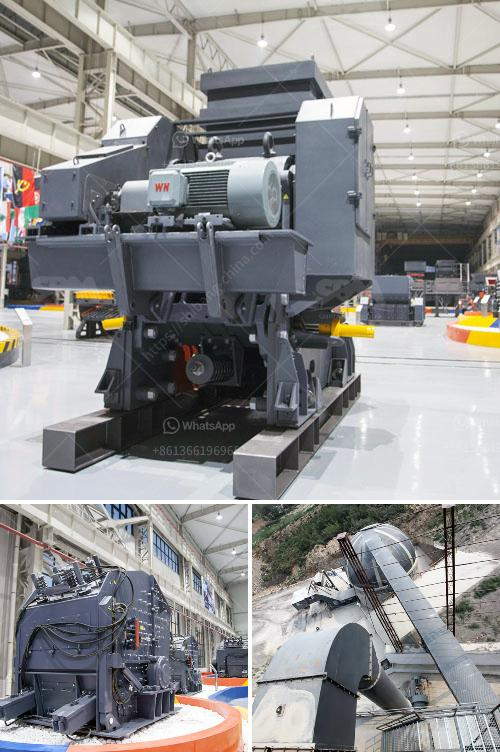

<h3>crusher stone plant limpopo</h3>
Crusher stone plant Limpopo is a leading manufacturer and supplier of various types of gravel and pebbles used for road construction, concrete production, landscaping, and other uses. The company also offers transportation services to carry the products to various destinations within and beyond the Limpopo province.

The crusher stone plant is located in Sekgopo village in Limpopo province, South Africa. It is proudly owned and operated by a local community cooperative, ensuring that the profits from the operation stay within the community and contribute to its development.

The plant produces high-quality crusher stones that are durable and can withstand heavy loads for extended periods. These stones are obtained from quarries within the region, ensuring a sustainable and reliable supply chain. The stones are produced through a crushing process that reduces large rocks into smaller, manageable sizes.

One of the main uses of the crusher stones is in road construction. They are used as a base material for constructing roads, providing stability and preventing soil erosion. The stones are compacted to form a solid foundation that can withstand the weight of vehicles and endure the effects of weather conditions. The use of crusher stones in road construction helps to enhance the durability and lifespan of the road infrastructure.

Another common use of crusher stones is in concrete production. They are mixed with sand, cement, and water to create a strong and durable building material. The stones provide volume and stability to the concrete mix, ensuring that the structures built with it can withstand various loads and environmental conditions.

Besides road construction and concrete production, crusher stones are also used for landscaping purposes. They are commonly used as decorative elements in gardens, driveways, and other outdoor spaces. The various colors and sizes of the stones offer endless design possibilities, allowing homeowners and landscapers to create aesthetically pleasing outdoor environments.

In addition to producing high-quality crusher stones, the plant in Limpopo also offers transportation services to deliver the products to customers. This service is particularly beneficial for construction companies and individuals who may not have their own transportation means to carry the heavy stones. The plant has a fleet of vehicles, including trucks and trailers, that are specially designed to safely transport the products to various destinations.

Crusher stone plant Limpopo is committed to providing excellent customer service and maintaining strong relationships with its clients. The company strives to meet the specific needs and requirements of each customer, ensuring their satisfaction. Whether it is providing the right type and quantity of stones, or offering timely and reliable transportation services, the company goes the extra mile to fulfill its customers' expectations.

In conclusion, Crusher stone plant Limpopo plays a vital role in the construction and landscaping industry in the Limpopo province. Its high-quality crusher stones, along with its transportation services, contribute to the development and enhancement of infrastructure in the region. The company's commitment to excellence and customer satisfaction sets it apart as a reliable and trustworthy supplier in the industry.
<h3>Contact us</h3><ul><li><strong>Whatsapp:&nbsp;<a href="https://wa.me/8613661969651">+8613661969651</a></strong></li><li><a href="https://swt.shibang-china.com/?git&amp;zhl&amp;crusher stone plant limpopo"><strong>Online Service(chat now)</strong></a></li></ul><h3>Related</h3><ul><li><a href='stone crusher machine in malaysia.md'>stone crusher machine in malaysia</a></li><li><a href='mobile crusher for.md'>mobile crusher for</a></li><li><a href='crusher stone price.md'>crusher stone price</a></li><li><a href='gold wash plants for sale in south africa.md'>gold wash plants for sale in south africa</a></li><li><a href='limestone crusher plant.md'>limestone crusher plant</a></li></ul>