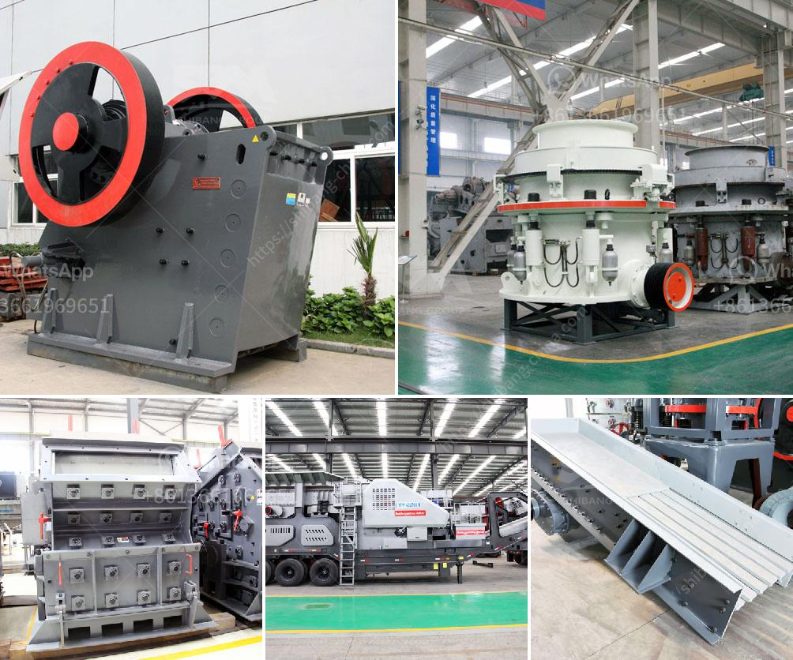

<h3>crusher stone price</h3>
When it comes to construction or landscaping projects, one of the most crucial factors to consider is the cost of materials. One such material that is commonly used in both residential and commercial projects is crusher stone. But what exactly is crusher stone, and how does it impact the overall project cost? 

Crusher stone, also known as crushed stone or angular rock, is a type of construction aggregate that is usually obtained by mining a suitable rock deposit. It is a popular choice for various applications, including road construction, driveway construction, and landscaping. 

The price of crusher stone can vary depending on several factors. One of the main determinants is the type of stone being used. Different types of crusher stones, such as granite, limestone, or basalt, will have varying prices due to their availability and quality. Additionally, factors like transportation costs and market demand can also play a role in the final price.

On average, the price of crusher stone can range from $10 per ton for basic gravel to $50 per ton for premium-grade materials. However, it’s essential to note that these prices are just rough estimates, and the actual cost can vary significantly from one supplier to another. It is always advisable to obtain multiple quotes from different suppliers to ensure you get the best value for your money.

Apart from the cost per ton, other expenses that can influence the overall price include delivery charges, taxes, and any additional fees levied by the supplier. Therefore, it is crucial to clarify these details with the supplier before finalizing your purchase.

In conclusion, crusher stone is a versatile construction material that can enhance the aesthetic appeal and functionality of any project. However, it is essential to consider the price of the stone, as it can significantly impact the overall project cost. By obtaining multiple quotes and comparing prices from different suppliers, you can make an informed decision and get the best deal possible. Remember, it’s crucial to factor in additional expenses like delivery charges to get an accurate estimate of the total cost.
<h3>Contact us</h3><ul><li><strong>Whatsapp:&nbsp;<a href="https://wa.me/8613661969651">+8613661969651</a></strong></li><li><a href="https://swt.shibang-china.com/?git&amp;zhl&amp;crusher stone price"><strong>Online Service(chat now)</strong></a></li></ul><h3>Related</h3><ul><li><a href='stone crushers in atlantico.md'>stone crushers in atlantico</a></li><li><a href='powder mill machines.md'>powder mill machines</a></li><li><a href='ball and pebble mills.md'>ball and pebble mills</a></li><li><a href='tons per day ball mill.md'>tons per day ball mill</a></li><li><a href='cost to setup mini cement plant in india.md'>cost to setup mini cement plant in india</a></li></ul>