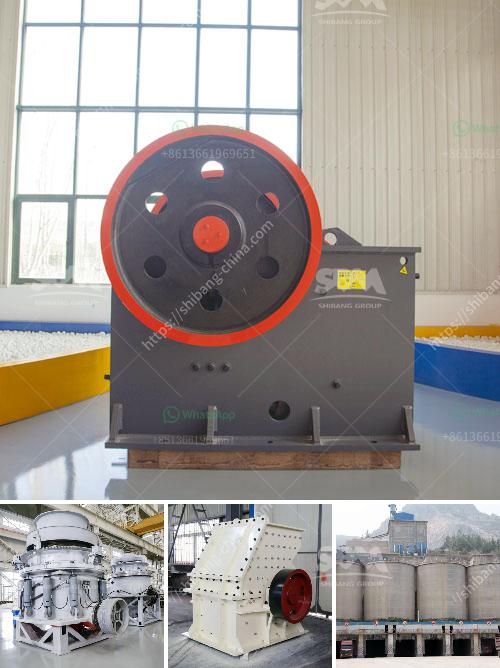

<h3>crusher type 600 tph</h3>
Crushers are essential pieces of machinery for mining and mineral processing operations. They are designed to reduce the size of large rocks, ores, and other materials into smaller, more manageable sizes. One popular crusher type in the market is the 600 tph crushing plant, which is widely used for various fields of mine, quarry, metallurgy, construction, and road industries. Let's take a closer look at this powerful equipment's capacity and features.

The 600 tph crusher is specifically designed to meet the unique challenges of working in high-capacity applications. With a robust and durable construction, it is capable of handling large feed sizes and achieving excellent crushing efficiencies. This crusher type is commonly used for primary crushing, enabling it to process large rock or ore into a size suitable for secondary crushers or mills.

One of the key features of the 600 tph crusher is its versatility in terms of applications. It can handle various types of materials, including hard and abrasive rocks, limestone, granite, basalt, and other similar materials, making it suitable for a wide range of projects. Whether you need to crush hard ores or produce aggregates for construction purposes, this crusher type can deliver reliable and efficient performance.

The 600 tph crusher also boasts of its high throughput capacity, which means it can process a large volume of material within a given timeframe. This allows for efficient production and helps to minimize downtime. With its advanced crushing chamber design, the crusher ensures uniform particle size distribution, producing high-quality end products.

In terms of operational convenience, the 600 tph crusher is equipped with user-friendly features. It typically comes with a hydraulic system for easy and quick adjustments of the crusher settings. This allows operators to optimize the machine's performance based on the specific requirements of the application. Additionally, the crusher is often designed with a remote control system, enabling operators to monitor and control the machine from a safe distance.

Another important aspect to consider when choosing the 600 tph crusher is its maintenance requirements. Regular maintenance is crucial for extending the equipment's lifespan and ensuring its continued performance. The manufacturer typically provides detailed maintenance guidelines and recommendations for optimal operation. Scheduled inspections and routine services are essential to minimize unexpected breakdowns and maximize productivity.

When selecting a crusher, it's important to consider factors such as production capacity, material hardness, and desired end product specifications. The 600 tph crusher offers an excellent combination of capacity, versatility, and efficiency, making it a reliable choice for various crushing applications. Whether you have a large mining operation or a construction project in need of high-quality aggregates, this crusher type can meet your requirements and provide consistent results.

In conclusion, the 600 tph crusher is a formidable piece of equipment that can handle challenging materials and deliver efficient crushing performance. Its high throughput capacity, versatile application range, and user-friendly features make it an ideal choice for various industries. By investing in a reliable crusher like this, mining and construction businesses can enhance their production capabilities and achieve their operational goals.
<h3>Contact us</h3><ul><li><strong>Whatsapp:&nbsp;<a href="https://wa.me/8613661969651">+8613661969651</a></strong></li><li><a href="https://swt.shibang-china.com/?git&amp;zhl&amp;crusher type 600 tph"><strong>Online Service(chat now)</strong></a></li></ul><h3>Related</h3><ul><li><a href='powdered limestone making places.md'>powdered limestone making places</a></li><li><a href='mini crusher roller mill.md'>mini crusher roller mill</a></li><li><a href='gold shaker wash plant trommel for sale used new.md'>gold shaker wash plant trommel for sale used new</a></li><li><a href='stone crushers made in greece.md'>stone crushers made in greece</a></li><li><a href='granite quarry business plan pdf.md'>granite quarry business plan pdf</a></li></ul>