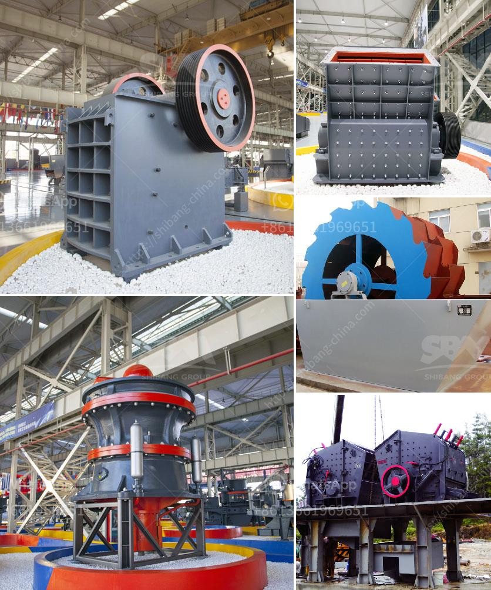

<h3>crusher unit price</h3>
A crusher unit, also known as a crusher plant, is a machine designed to break large rocks into smaller rocks, gravel, or rock dust. Crushers are utilized to reduce the size of raw materials, which are then used for various purposes such as construction materials, road building, and mining.

When considering purchasing a crusher unit, the price is an important factor to consider. The cost of a crusher unit can vary depending on several factors, including the size, brand, capacity, and additional features. Here, we will discuss the factors that determine the unit price and their significance.

The size of the crusher unit plays a crucial role in determining the price. Smaller units are generally cheaper compared to larger ones. However, it is essential to consider the desired capacity and output requirements to ensure that the chosen size meets the specific needs of the project.

The brand's reputation and market standing also impact the unit price. Established brands with a track record of quality and reliability are likely to have higher prices than lesser-known brands. Choosing a reputable brand is crucial to ensure longevity and efficiency.

The capacity of the crusher unit is another significant factor in determining the price. Higher capacity units are generally more expensive, as they can process larger quantities of material in a shorter amount of time. It is essential to consider the required capacity according to the project's scale and demands.

Certain additional features can enhance the functionality and efficiency of a crusher unit, such as adjustable settings, automated controls, and easy maintenance options. These features may increase the unit price, but they can greatly contribute to the overall performance and ease of use.

To make an informed decision, it is essential to conduct a comparative analysis of the crusher unit prices offered by different manufacturers or suppliers. This analysis should consider the aforementioned factors while also evaluating the quality, warranty, and after-sales service provided.

In conclusion, when considering the purchase of a crusher unit, it is important to evaluate the size, brand, capacity, additional features, and conduct a comparative analysis to determine the best unit price. While price is a crucial factor, it should not be the sole determining factor, as the quality, performance, and longevity of the unit are equally significant. Investing in the right crusher unit can significantly impact the success and efficiency of any construction or mining project.
<h3>Contact us</h3><ul><li><strong>Whatsapp:&nbsp;<a href="https://wa.me/8613661969651">+8613661969651</a></strong></li><li><a href="https://swt.shibang-china.com/?git&amp;zhl&amp;crusher unit price"><strong>Online Service(chat now)</strong></a></li></ul><h3>Related</h3><ul><li><a href='lm vertical grinding mill.md'>lm vertical grinding mill</a></li><li><a href='quarry stone for sale in malta.md'>quarry stone for sale in malta</a></li><li><a href='bentonite jaw crushers india.md'>bentonite jaw crushers india</a></li><li><a href='rental crusher rinda.md'>rental crusher rinda</a></li><li><a href='sewa mobil crusher di kaltim.md'>sewa mobil crusher di kaltim</a></li></ul>