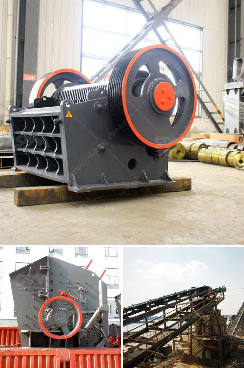

<h3>crushers for sale south africa</h3>
Crushers for Sale in South Africa: Unleashing the Potential of Excavated Rock for Construction and Mining Industries

Lately, Africa's construction and mining industries are witnessing a boom in the implementation of exemplary technological advancements that are bound to simplify the processes. Crushers, being the core machinery in the ore and stone quarrying industries, are seeing a surge in demand due to the rapid growth and development taking place in these industries. In South Africa, specifically, crushers are sought after for their ability to produce high-quality aggregates – an essential component in the construction industry.

Crushers are indispensable machines in the mining and quarrying industry. Different types of stone crushers have different models, names and functions. Sometimes they are named according to materials such as rock crushers, ore crushers, quarry crushers, granite crushers, concrete crushers, etc. Among those, jaw crusher is the most common, which can be divided into fixed jaw crushers and mobile jaw crushers depending on the way of installation.

To accommodate different mining plants' needs, there are several types of crushers in the market that are available in South Africa. Some of the crushers are designed to work 24/7, converting large pieces of rock into manageable pieces for construction and mining. Others are mobile, allowing operators to move the crusher unit closer to the quarry or mining site for efficient crushing operations. Crushers are available in stationary, track-mounted, and mobile configurations to meet the diverse demands of the South African market.

Quality-built crushers are ensured through reputable manufacturers and suppliers in South Africa. Crushers are extensively used in mining applications and operations where the ore and rock must be crushed to reduce its size for further processing. Mining industries, particularly the gold and diamond sectors, have always been a pillar of the South African economy, driving the nation's vast infrastructure development. Therefore, crushers with the capability to process high volumes of materials efficiently are highly sought after.

In South Africa, a substantial amount of research and development has been invested into the design and improvement of crushers specially made for crushing softer materials. This has further fuelled the demand for crushers as it allows for easy feeding and efficient crushing operations. The crushers for softer materials have unique design, which allows them to perform better with lower power consumption, better particle shape, and higher production capacity.

Beyond the mining sector, crushers also have applications in the construction industry. Due to urbanization and the increasing demand for infrastructure, South Africa's construction industry is growing rapidly. Crushers have become indispensable construction equipment, transforming construction waste into reusable materials. By recycling construction waste, the crushers play a significant role in reducing pollution and waste generation while simultaneously contributing to economic growth.

In a nutshell, crushers play a pivotal role in the mining and construction industries. Crushers for sale in South Africa are capable of breaking large stones into smaller stones as required by the construction industry. You will have the ability to meet the demand for both large and small stones and also provide stones with specific sizes that the customer needs. Crushers come with a variety of specifications and can have different motor capabilities. Depending on the application, where the crushers will be installed, it is crucial to choose the right type of crusher for your needs.

In conclusion, crushers for sale in South Africa have an outstanding performance in crusher industry. They are sold in South Africa due to high demand for crushers. There are many suppliers and manufacturers of crusher machines in South Africa. Shanghai SBM is one of them. It offers all kinds of crusher machines and grinding machines as well as some stone quarry mining equipment. Based upon the significant optimization, SBM has developed the vibratory screens, circular vibrating screen, fine screening equipment and all kinds of crusher machines for sale in South Africa. They are designed in unique structure in order to optimize the screening efficiency and vibrating strength. It is also essential to offer the correct size of mesh screen decks to the end user. Investing in high-quality crushers and equipment can lead to high returns in the long run, as these machines are designed for durability and excellent performance in the toughest mining and construction environments.
<h3>Contact us</h3><ul><li><strong>Whatsapp:&nbsp;<a href="https://wa.me/8613661969651">+8613661969651</a></strong></li><li><a href="https://swt.shibang-china.com/?git&amp;zhl&amp;crushers for sale south africa"><strong>Online Service(chat now)</strong></a></li></ul><h3>Related</h3><ul><li><a href='iron ore magnetic separation from titanium process.md'>iron ore magnetic separation from titanium process</a></li><li><a href='sand sieve machine.md'>sand sieve machine</a></li><li><a href='small jaw crushers.md'>small jaw crushers</a></li><li><a href='artificaial sand machine germany.md'>artificaial sand machine germany</a></li><li><a href='grinder machine for quartz.md'>grinder machine for quartz</a></li></ul>