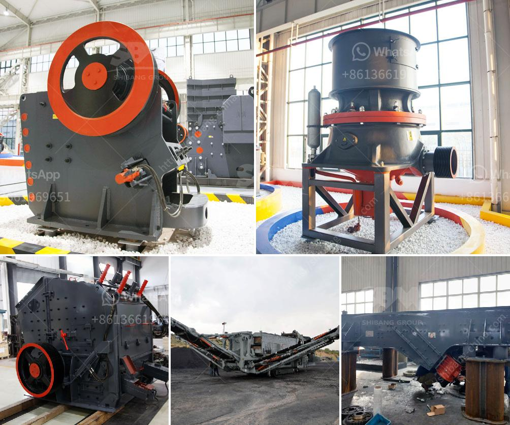

<h3>crushers for sale</h3>
Crushers have become an essential part of various industries, especially in mining and construction. These machines play a crucial role in reducing the size of different types of materials to make them usable for various purposes. Whether it is stones, rocks, or minerals, crushers are designed to efficiently break them down into smaller pieces.

With the increasing demand for crushers, several manufacturers have started offering a wide range of crusher units for sale. They have a vast collection of machines to meet the diverse needs of customers across the globe. With a variety of options available, buyers can find the best-suited crusher to meet their specific requirements.

One popular selling option in the market is crushers for sale with a capacity between 100 to 300 tons per hour. These units are perfect for medium-scale operations that require high productivity. Depending on the material, the crushers can produce multiple sizes of aggregates, giving users great flexibility in their operations.

When considering crushers for sale, buyers should ensure that the machines offer excellent performance with minimal downtime. High-quality crushers come with robust construction and reliable components that can withstand the toughest working conditions. They are equipped with powerful motors that efficiently crush materials and reduce energy consumption.

Furthermore, buyers should also consider crushers that offer easy maintenance and low operating costs. A crusher with easily replaceable wear parts allows for quick repairs and reduces production interruptions. Additionally, features like dust suppression systems and noise reduction technology are essential for compliance with environmental regulations.

In conclusion, crushers for sale have revolutionized the mining and construction industries, enabling efficient and cost-effective material processing. With a wide range of options available, buyers should look for crushers that offer high productivity, durability, ease of maintenance, and low operating costs. By investing in a reliable crusher, businesses can enhance their productivity and meet their material processing needs effectively.
<h3>Contact us</h3><ul><li><strong>Whatsapp:&nbsp;<a href="https://wa.me/8613661969651">+8613661969651</a></strong></li><li><a href="https://swt.shibang-china.com/?git&amp;zhl&amp;crushers for sale"><strong>Online Service(chat now)</strong></a></li></ul><h3>Related</h3><ul><li><a href='ball crusher gold machine.md'>ball crusher gold machine</a></li><li><a href='set up a quarry for ballast stones south africa.md'>set up a quarry for ballast stones south africa</a></li><li><a href='used small stone crusher mill california.md'>used small stone crusher mill california</a></li><li><a href='gold mining crushing and milling machine.md'>gold mining crushing and milling machine</a></li><li><a href='stone crusher in davao.md'>stone crusher in davao</a></li></ul>