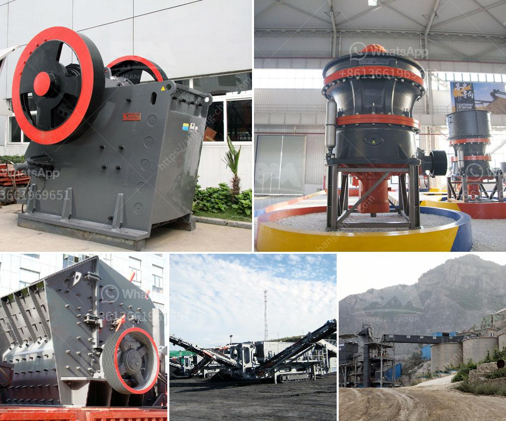

<h3>crusherstone machine in china</h3>
China is a significant producer of various types of industrial minerals. Crushed stone, governs the majority of the demand for these materials used in construction projects. With the increasing industrialization and infrastructure development in the country, the demand for crushed stone has been growing exponentially. As a result, China has established a robust industry, focusing on the production of quality crusherstone machines that efficiently break down and crush rocks into smaller sizes.

Crusherstone machines, also known as crushers, are mechanical devices specially designed to reduce the size of rocks and stones. These machines play a crucial role in numerous applications, including road construction, building construction, mining, and agriculture.

China has emerged as one of the leading manufacturers and exporters of crusherstone machines in the world. The Chinese manufacturers have gained a reputation for delivering state-of-the-art machines that are efficient, durable, and innovative. Advancements in technology have fueled the development of crusherstone machines, resulting in improved performance and productivity.

Additionally, China's crusherstone machines have become more energy-efficient, reducing operational costs and environmental impact. With the emphasis on sustainability and eco-friendliness, Chinese manufacturers have incorporated features like energy saving motors and dust control systems, ensuring compliance with stringent environmental regulations.

China's crusherstone machines are available in different sizes and models to cater to various crushing requirements. Whether it is large-scale mining or small-scale construction projects, there is a machine designed to suit every need. Furthermore, Chinese manufacturers offer customized solutions, enabling buyers to select the ideal machine for their specific applications.

Another significant advantage of China's crusherstone machines is their competitive pricing. The cost-effectiveness of these machines makes them highly sought after by customers worldwide. Additionally, Chinese manufacturers provide comprehensive after-sales services, including installation, maintenance, and spare parts supply, ensuring smooth and uninterrupted operations.

In a nutshell, China's crusherstone machines have revolutionized the stone crushing industry. With advanced technology, efficiency, and competitive pricing, these machines have become a game changer in various sectors. As the demand for crushed stone continues to rise globally, China's crusherstone machines will play a pivotal role in meeting this demand, contributing to the growth and development of the construction and mining sectors worldwide.
<h3>Contact us</h3><ul><li><strong>Whatsapp:&nbsp;<a href="https://wa.me/8613661969651">+8613661969651</a></strong></li><li><a href="https://swt.shibang-china.com/?git&amp;zhl&amp;crusherstone machine in china"><strong>Online Service(chat now)</strong></a></li></ul><h3>Related</h3><ul><li><a href='mobile crusher malaysia for sell.md'>mobile crusher malaysia for sell</a></li><li><a href='production line for calcium carbonate.md'>production line for calcium carbonate</a></li><li><a href='selling conveyor belts in kenya.md'>selling conveyor belts in kenya</a></li><li><a href='calcium carbonate powder processing plant.md'>calcium carbonate powder processing plant</a></li><li><a href='kenya roller mill.md'>kenya roller mill</a></li></ul>