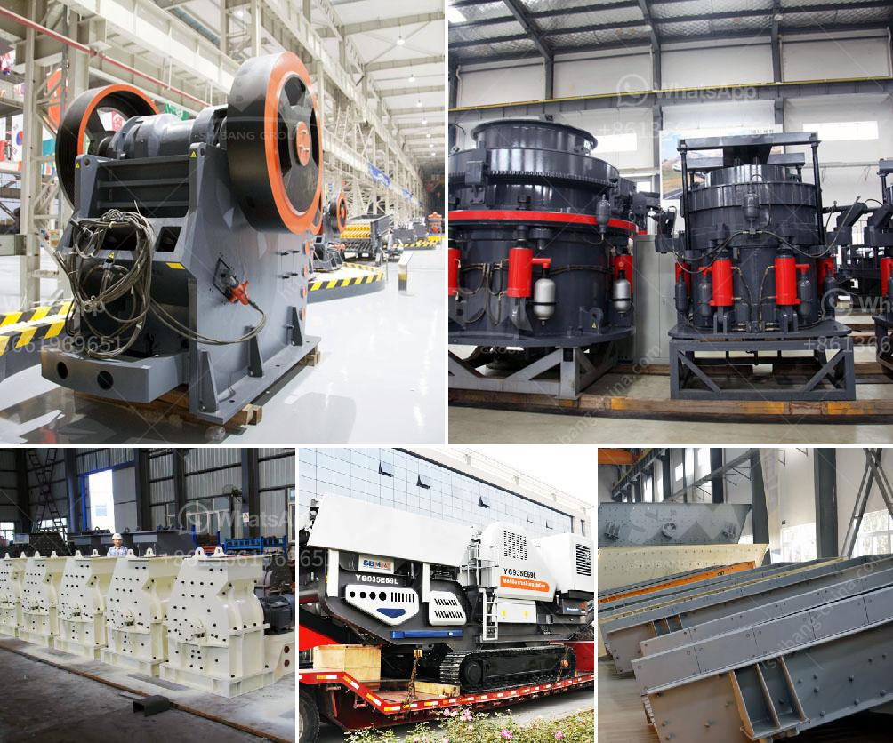

<h3>crushing and mining machine</h3>
Crushing and mining machines play a vital role in extracting valuable minerals and materials from the Earth. These machines are used to break down large rocks into smaller, more manageable sizes, which can then be used for various industrial purposes. From quarrying to ore processing, crushing and mining machines have revolutionized the mining industry.

One of the most commonly used machines in the mining industry is the jaw crusher. This machine is designed to crush hard, abrasive materials for further processing. The jaw crusher consists of a fixed jaw plate and a moving jaw plate. When the feed material enters the crushing chamber, the moving jaw plate moves towards the fixed jaw plate, exerting pressure and crushing the rocks.

Another popular crushing machine is the cone crusher. It works on the principle of compression crushing, where the material is squeezed between an eccentrically rotating mantle and a concave hopper. Cone crushers are ideal for secondary and tertiary crushing stages, as they can produce finer and more uniform particles compared to jaw crushers.

Impact crushers are also widely used in mining operations. These machines use impact force to crush the material, making them suitable for both primary and secondary crushing tasks. Impact crushers are particularly useful in reducing the size of soft, non-abrasive materials like limestone, gypsum, and coal.

In addition to crushers, mining machines also include screens, conveyors, and feeders. Screens are used to sort and separate materials based on their size, enabling efficient processing and reducing the need for manual labor. Conveyors and feeders, on the other hand, are responsible for transporting the mined material from one process to another. They ensure a continuous flow of material, enhancing productivity and reducing downtime.

Advancements in technology have led to the development of sophisticated crushing and mining machines. Automation and remote control systems allow operators to monitor and control the machines from a centralized location, ensuring safe and efficient operation. Additionally, improvements in wear resistance materials have extended the lifespan of machine components, reducing maintenance costs and increasing productivity.

The significance of crushing and mining machines in the mining industry cannot be overstated. These machines are fundamental to the extraction and processing of minerals, playing a crucial role in the global economy. Without them, we would not have access to essential resources like metals, fossil fuels, and construction materials. Moreover, these machines have helped increase production efficiency, minimize environmental impact, and improve worker safety.

In conclusion, crushing and mining machines are integral to the mining industry. From jaw crushers to impact crushers, these machines break down large rocks into smaller, more manageable sizes for further processing. Screens, conveyors, and feeders aid in the transportation and sorting of materials. Advancements in technology have further enhanced the efficiency and safety of these machines. With their indispensable contributions, crushing and mining machines continue to revolutionize the mining industry and support global development.
<h3>Contact us</h3><ul><li><strong>Whatsapp:&nbsp;<a href="https://wa.me/8613661969651">+8613661969651</a></strong></li><li><a href="https://swt.shibang-china.com/?git&amp;zhl&amp;crushing and mining machine"><strong>Online Service(chat now)</strong></a></li></ul><h3>Related</h3><ul><li><a href='grinding ball for ball mills.md'>grinding ball for ball mills</a></li><li><a href='gyratory gyratory crusher manufacturer in india.md'>gyratory gyratory crusher manufacturer in india</a></li><li><a href='stone crushing machine factories in shanghai.md'>stone crushing machine factories in shanghai</a></li><li><a href='crusher plant design.md'>crusher plant design</a></li><li><a href='price of gypsum plant machines.md'>price of gypsum plant machines</a></li></ul>