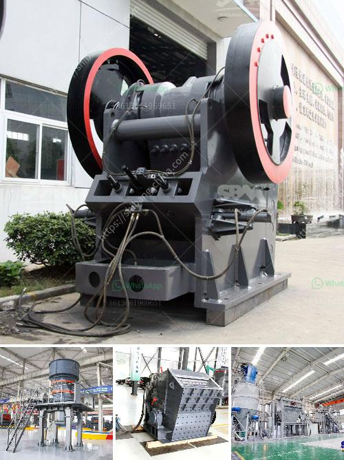

<h3>crushing and screening of manganese ore</h3>
Manganese ore is a global commodity and is used mainly in the production of steel. Manganese is the world's fourth-most consumed metal by weight behind iron, aluminium, and copper. Manganese ore is produced globally, typically in large tonnages (~millions of tonnes per year). It is primarily extracted through open-pit mining methods and undergoes several stages of crushing and screening to produce a marketable product. 

The first stage in manganese ore beneficiation is crushing and screening. This involves breaking the ore into smaller pieces which are then processed through a series of screens to separate the ore particles based on size. This process helps in removing impurities, such as silica and alumina, from the ore, thus improving its purity and reducing its impurity content.

The crushing stage is crucial in the preparation of manganese ore for further processing. The ore is crushed into smaller pieces through a combination of jaw and cone crushers, which reduces the ore to a manageable size for further screening and processing. Oversized material is conveyed to the crusher and crushed again until it is suitable for screening.

After the initial crushing stage, the ore enters the screening process. In this stage, the ore is separated into different size fractions using a series of vibrating screens. The screens are designed to separate the ore into different grades based on particle size. This process helps in classifying the ore and ensuring that only the desired size fraction is further processed.

Manganese ore screening is crucial in determining the final product size and purity. Oversized material is sent back for further crushing and screening, while undersized material is sent directly to the stockpile. The screened ore is then transported to a processing plant for further refinement and preparation for the steelmaking process.

The crushing and screening process of manganese ore is complex. Crushing is done in stages, where the ore is reduced to a manageable size before being processed further. Screening ensures that only the desired size fraction is further processed, while oversize and undersize material is separated for reprocessing.

Crushing and screening of manganese ore plays a vital role in the beneficiation and processing of the ore. It is necessary to select the appropriate equipment and use optimal settings to achieve the desired product size and purity. Proper crushing and screening ensure that the manganese ore meets the specifications required by steel producers, making it a valuable commodity in the global market.

In conclusion, the crushing and screening of manganese ore is an essential step in the production of steel. The process helps in removing impurities, classifying the ore, and preparing it for further processing. The proper crushing and screening ensure that the final product meets the desired specifications, making manganese ore a valuable commodity in the global market.
<h3>Contact us</h3><ul><li><strong>Whatsapp:&nbsp;<a href="https://wa.me/8613661969651">+8613661969651</a></strong></li><li><a href="https://swt.shibang-china.com/?git&amp;zhl&amp;crushing and screening of manganese ore"><strong>Online Service(chat now)</strong></a></li></ul><h3>Related</h3><ul><li><a href='gravel washing plant for sale in uk.md'>gravel washing plant for sale in uk</a></li><li><a href='used portable stone crusher machine for sale usa.md'>used portable stone crusher machine for sale usa</a></li><li><a href='fine grinding equipment.md'>fine grinding equipment</a></li><li><a href='ball mill hammer mill roller mill machine.md'>ball mill hammer mill roller mill machine</a></li><li><a href='industrial crusher machine.md'>industrial crusher machine</a></li></ul>