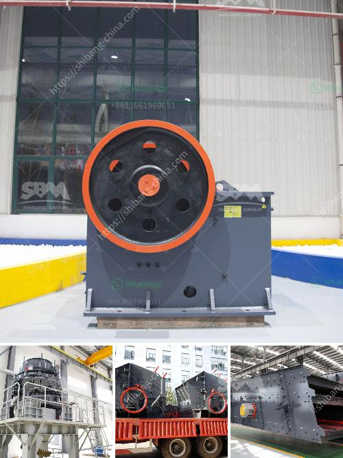

<h3>crushing and screening plants</h3>
Crushing and screening plants play a vital role in the construction industry. They are essential tools that allow contractors and builders to easily obtain materials such as aggregate and sand, which are crucial components for various construction projects.

These plants consist of several components, including a primary crusher, secondary crusher, and vibrating screens. The primary crusher is responsible for reducing large rocks into small-sized rocks or gravel. It is typically the first step in the process and is capable of handling large rocks up to several feet in size.

After the primary crusher, materials are then fed into the secondary crusher, which further breaks down the rocks into smaller pieces. This step ensures that the materials are of the desired size and ready for further processing.

Another crucial aspect of crushing and screening plants is the vibrating screens. These screens play a vital role in separating materials based on their size. They ensure that materials meet the required specifications and are free from any contaminants.

One primary benefit of using crushing and screening plants is in the production of high-quality materials. These plants ensure that the materials used in construction projects are of the required specifications, whether it is for roads, buildings, or other infrastructure projects. By controlling the size and quality of the materials produced, contractors can guarantee the overall quality of their final products.

Additionally, crushing and screening plants are highly efficient and cost-effective. They allow contractors to process large quantities of materials on-site, eliminating the need for transportation to and from a quarry. This not only saves time but also reduces transportation costs, making these plants a cost-effective solution for construction projects.

Furthermore, crushing and screening plants are designed to be versatile and flexible. They can be easily transported and set up at different locations depending on the project requirements. This flexibility ensures that contractors can quickly adapt to changing project demands and efficiently meet construction deadlines.

Moreover, the use of crushing and screening plants also benefits the environment. By crushing and recycling materials on-site, contractors can reduce the need for new raw materials, thus lowering energy consumption and minimizing the overall impact on the environment. Additionally, the use of recycled materials contributes to sustainable construction practices.

In conclusion, crushing and screening plants are indispensable in the construction industry. They provide contractors with high-quality materials that meet the required specifications, while also offering cost savings, flexibility, and environmental benefits. These plants are crucial tools for any construction project, ensuring efficient and sustainable construction practices.
<h3>Contact us</h3><ul><li><strong>Whatsapp:&nbsp;<a href="https://wa.me/8613661969651">+8613661969651</a></strong></li><li><a href="https://swt.shibang-china.com/?git&amp;zhl&amp;crushing and screening plants"><strong>Online Service(chat now)</strong></a></li></ul><h3>Related</h3><ul><li><a href='clay working clay powder making machine.md'>clay working clay powder making machine</a></li><li><a href='ball mill instrument equipment.md'>ball mill instrument equipment</a></li><li><a href='copper ore crushing plant brazil.md'>copper ore crushing plant brazil</a></li><li><a href='used asphalt batch plant for sale in dubai.md'>used asphalt batch plant for sale in dubai</a></li><li><a href='limestone powder making plant ireland.md'>limestone powder making plant ireland</a></li></ul>